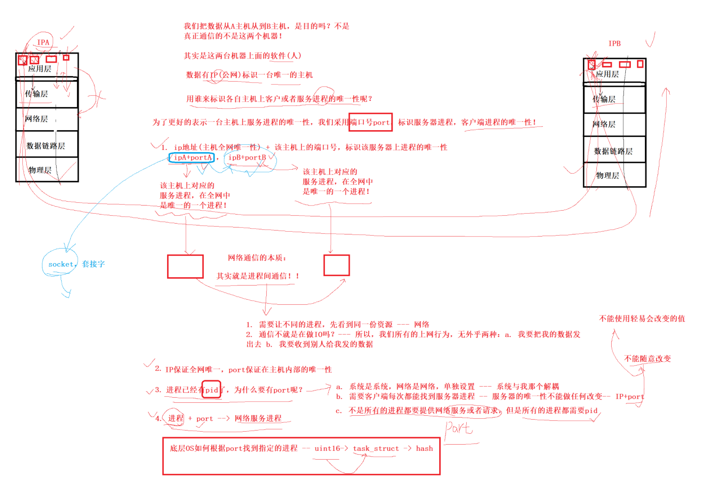
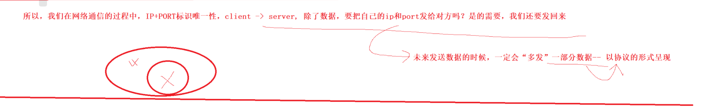
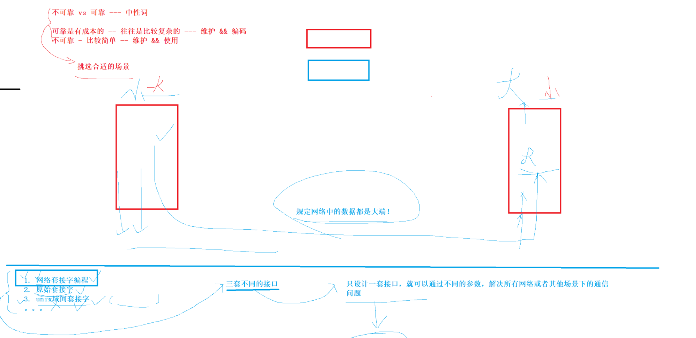
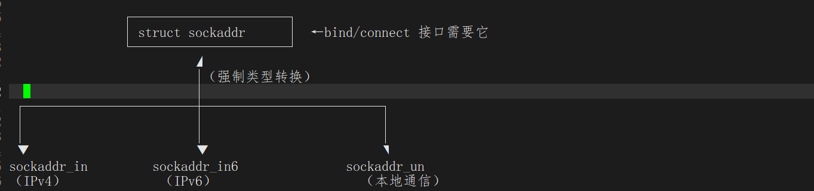

# 10套接字

## lesson41

## 1ip + port



**源  ip地址：发送端:从哪儿来**

**目的ip地址：接受端:到哪儿去**

**从哪儿来--到哪儿去**

**IPA          ....路由器....            IPB**


**我们把数据从A主机送到B主机是目的吗？不是,**

**真正通信的，不是这两个机器！**

**其实这两台机器上面的软件(人)**


**数据有IP（公网IP）表示一台唯一的主机。**

**用谁来标识各：主机手客户回执服务器的进程唯一性呢？**

​	**为了更好的表示一台主机上服务进程的唯一性，我们采用端口号por，标识服务器进程，客户进程的唯一性。**

**1.ip地址(主机全网唯一性) + 该主机上的端口号，标识该服务器上进程的唯一性。**

​	**ipA + portA,  ipB + portB**

​	**该主机上对应的服务进程，在全网中是唯一的一个进程。ip + port。**

​	**该主机上对应的服务进程，在全网中是唯一的一个进程。ip + port。**

​	**网络通信的本质：**

​		**网络通信的本质：其实就是进程间通信！！**

​	**服务端   网络   客户端**

​		**1.进程间通信，先让不同的进程看到同一份资源----网络**

​		**2.通信不就是在做IO吗？---- 所有我们所有的上网行为：无外乎两种：我要把我的数据发出去。我要收到别人发给我的数据。**

**2ip保证全网唯一（这里是公网IP），port保证在主机内部的唯一性。**

**3进程已经有了pid，为什么有还需要port呢？**

​	**1.系统是系统，网络是网络。单独设置---为了系统和网络解耦。**

​	**2.需要客户端每次都能找到服务器进程--服务器的唯一性不能做任何改变。IP+PORT不能随便改变的。不能随意改变。不能使用轻易会改变的值。**

​	**3.不是所有的进程都需要提供网络服务或者请求，但是所有的进程都需要pid。这就是为什么不使用pid标定在网络中的唯一性。**

**4进程 + port ---》网络服务进程**

​	**底层OS如何根据port找到指定的进程---》uint16-->task_struct -->hash(基于端口号 key, value pcb地址) pcb 文件 文件缓冲区。**

​	**pcb可能是多个数据结构的 点。多种数据结构的组合点。**

**一个进程可以绑定多个端口号，但是一个端口号不能被多个进程绑定。**

**我们在网络通信的过程中，IP+PORT标识唯一性  client-->server。除了数据，需要把自己的ip和port发给对方吗？需要的，我们还要发回来**

**我们在网络通信的过程中，IP+PORT标识唯一性  client-->server。除了数据，需要把自己的ip和port发给对方吗？需要的，我们还要发回来**



**未来发数据的时候，一定会  多发 一部分数据--以协议的形式呈现。**

**端口号是传输层协议的内容：**

​	**传输层的端口号。**


## 2传输层协议

**TCP协议：TCP 是一种面向连接的、可靠的、基于字节流的传输层通信协议。**

​	**传输层协议**

​	**有连接**

​	**可靠传输**

​	**面向字节流：TCP 传输数据的时候，不关心消息（message）边界，只把所有数据当成一串连续的字节流来传输。**

**UDP协议：UDP 是一种无连接的、不可靠的传输层通信协议。**

​	**传输层协议**

​	**无连接**

​	**不可靠传输**

​	**面向数据报：面向数据报 = 有边界、每个消息独立传输，发送端的一个数据报对应接收端的一个数据报。**

**面向数据报（UDP）：每个包独立、有边界、不能被拆或合并，可能丢失、乱序、不可靠但速度快。**

**面向字节流（TCP）：数据无边界，是连续字节流，可能粘包、拆包，但可靠、顺序。**

**不可靠和可靠是中性词。**

**可靠是有成本的---这样的协议往往是复杂的---维护&&编码**

**不可靠-----------这样的协议往往比较简单---维护和使用 **

**挑选合适的场景。**


## 3网络字节序

**发送主机通常将发送缓冲区中的数据按内存地址从低到高的顺序发出;**

**网络字节序列**

**接受方，怎么知道是发送的数据是大小端？？**

**规定网络中的数据都是大端。**

**网络字节流：**

**发送主机通常将发送缓冲区中的数据按内存地址从低到高的顺序发出。++简单**

**网络字节序：网络字节序 = 规定使用大端字节序（Big-Endian）来表示多字节数据。**

**0x12345678**

**网络字节序（大端）：**

**12 34 56 78**

```
h: host主机
n: net网络
l: long 32字节
s: short 16字节
uint32_t htonl(uint32_t hostlong);
uint16_t htons(uint16_t hostshort);
uint32_t ntohl(uint32_t netlong);
uint16_t ntohs(uint16_t netshort);
```




## 4套接字

**通信：我们写的代码是应用层方面。**

**ip + port:== 套接字**

**socket:插座**

**1网络套接字编程：跨主机和网络**

**2原始套接字：**

**3Unix域间套接字：**

**三套不同的接口。只是设计一套接口，通过参数的不同，解决所有网络或者其他场景下的通信问题。**

**设计这一套c语言不支持void***  

**操作系统级别的接口**

**struct sockadd struct sockadd_in struct sockadd_un**




## 5UDP

**struct socaddr_in结构体**

```c
struct sockaddr_in 
{
    sa_family_t    sin_family;   // 地址族（AF_INET）
    in_port_t      sin_port;     // 端口号（网络字节序）
    struct in_addr sin_addr;     // IPv4 地址
    char           sin_zero[8];  // 填充字段，使结构体与 sockaddr 大小对齐
};
// sin的s是socket
// sin的in是internet
```

### 服务端

```c++
#include <iostream>
#include <cstring>
#include <sys/types.h>
#include <sys/socket.h>
#include <arpa/inet.h>
#include <netinet/in.h>
#include <string>
using namespace std; 

int main()
{
// 1.创建一个文件描述符，用来进行udp通信的
  // AF_INET:通信的协议
  int socketfd = socket(AF_INET, SOCK_DGRAM, 0);
  if(socketfd < 0)
  {
    perror("socket");
    exit(1);
  }

  struct sockaddr_in local;
  memset(&local, 0, sizeof local);

// 2.服务器的信息需要设置内核里面的
  local.sin_family = AF_INET;
  local.sin_addr.s_addr = htonl(INADDR_ANY);
  local.sin_port = htons(8080);
  
  // 2.1bind进内核里面去的
  int n = bind(socketfd, (struct sockaddr*)&local, sizeof local);
  if(n == -1)
  {
    perror("bind");
    exit(1);
  }

// 3.开始通信
  
  char buffer[1024];
  char ip_str[INET_ADDRSTRLEN];
  while(true)
  {
    struct sockaddr_in client;
    socklen_t len = sizeof client;

    ssize_t s  = recvfrom(socketfd, buffer, sizeof(buffer) - 1, 0, (struct sockaddr*)&client, &len);
    if(s > 0)
    {
      buffer[s] = 0;
      // 客户端的端口和ip
      uint16_t port = ntohs(client.sin_port);
      inet_ntop(AF_INET, &client.sin_addr.s_addr, ip_str, sizeof(ip_str)); 
      cout<<"ip:" << ip_str << "-" << "port:" << port << " 发的信息:" << buffer << endl;

      string echo = "客户端您的信息已经收到了，祝您生活愉快，天天开心。";
      sendto(socketfd, echo.c_str(), echo.size(), 0, (struct sockaddr*)&client, sizeof(client));
    }
  }
  return 0;
}

```

**1.udp的套接字类型是数据报的。一个一个报文的**

**2.bind进内核的意思：客户端知道如何进行发送。知道那个主机的地址。主机上的进程。类似知名端口。**

**3.udp是全双工的，数据可以进行发送，可以进行接收的。**

**核心原因在于：网络协议栈只负责解析协议头部的固定字段，而数据载荷（payload）的字节序完全由应用程序自己定义和处理。**


### 客户端

```c++
#include <iostream>
#include <cstring>
#include <sys/types.h>
#include <sys/socket.h>
#include <arpa/inet.h>
#include <netinet/in.h>
#include <string>
using namespace std; 


int main(int argc, char* argv[])
{

// ip和端口
  string serverip = argv[1];
  uint16_t serverport = atoi(argv[2]);

  if(argc != 3)
  {
    cout<< "usage: ./a.out ip port" <<endl;
  }
// 1.创建一个文件描述符，用来进行udp通信的
  // AF_INET:通信的协议
  int socketfd = socket(AF_INET, SOCK_DGRAM, 0);
  if(socketfd < 0)
  {
    perror("socket");
    exit(1);
  }

  struct sockaddr_in server;
  memset(&server, 0, sizeof(server));
  
// 2.服务端的信息, 
  server.sin_family = AF_INET;
  server.sin_port = htons(serverport);
  inet_pton(AF_INET, serverip.c_str(), &server.sin_addr);
  

// 3.开始发送消息
  string message;
  char buffer[1024];
  while(true)
  {
    cout<<"enter:";
    cin>>message;
    sendto(socketfd, message.c_str(), message.size(), 0, (struct sockaddr*)&server,  sizeof(server));
    
    recvfrom(socketfd, buffer, sizeof(buffer), 0, nullptr, 0);
    cout<< buffer << endl;
  }
  return 0;
}
```


## lesson42

**用户 应用层**

**OS  传输层 网络层**

**驱动 数据链路层 物理层 **

**数据不断封装和解包**

**机器间的进程通信。**

**ip地址标识该主机地址在网络的唯一性**

**port标识该服务器里面进程的唯一性**

**网络通信的本质：其实就是进程间通信。**

**ip + port = socket**

**网络字节序**

**发送数据的大小端：规定都是大端**

**套接字种类很多。**

```
struct sockaddr
struct sockaddr_in
struct sockaddr_un
```

**127.0.0.1:本队环回：服务器代码的测试**

**应用层**

**传输层**

**网络层**

**数据链路**

```
netstat -nuap
 -n:number
 -u:udp
 -a:all
 -p:process
```

**HTTP （HyperText Transfer Protocol）**

**HTTPS（HyperText Transfer Protocol Secure）**

**https://gitee.com/lichermione/projects**


