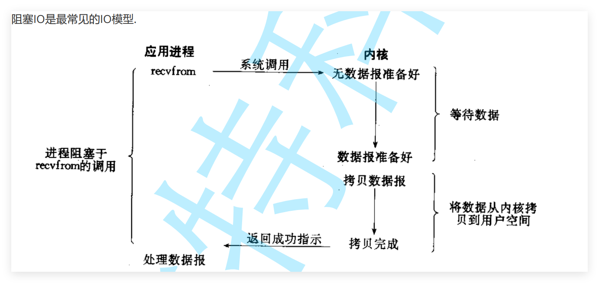
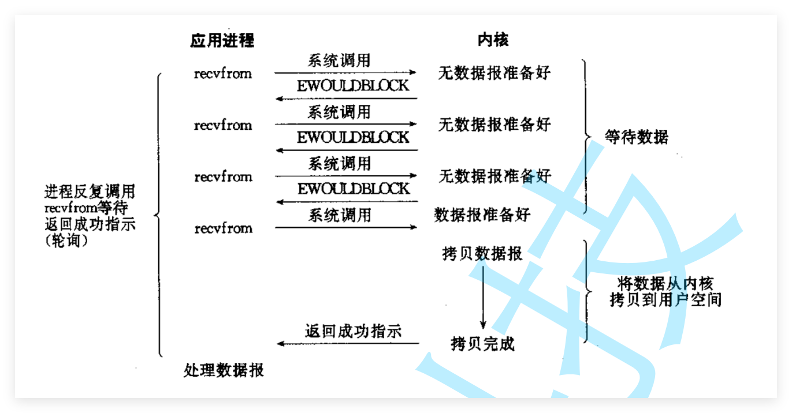
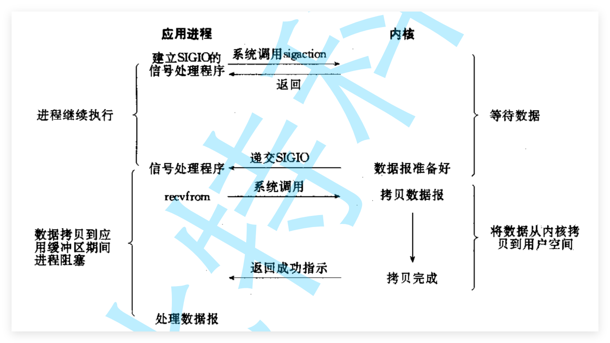
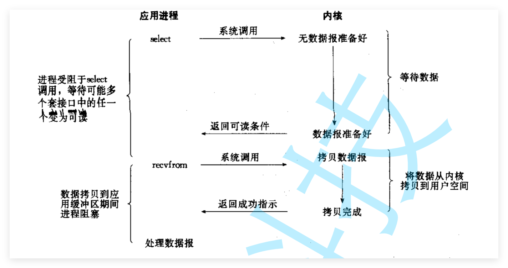
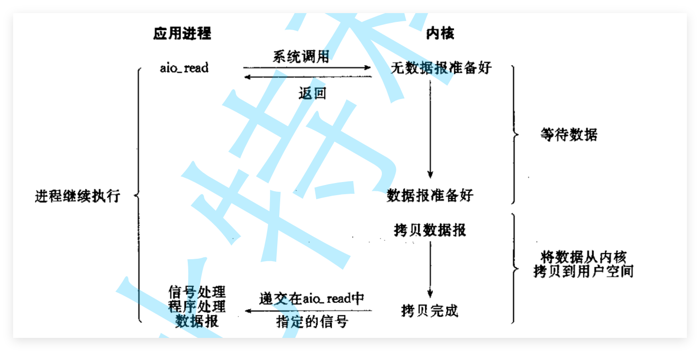

# 13高级IO

## 1.IO

**阻塞IO**



**在内核将数据准备好之前, 系统调用会一直等待. 所有的套接字, 默认都是阻塞方式**

**阻塞IO是最常见的IO模型. 因为简单**


**非阻塞IO**



**非阻塞IO: 如果内核还未将数据准备好, 系统调用仍然会直接返回, 并且返回EWOULDBLOCK错误码.**

**轮询:   非阻塞IO往往需要程序员循环的方式反复尝试读写文件描述符**


**信号驱动IO**



**IO多路转接: 虽然从流程图上看起来和阻塞IO类似. 实际上最核心在于IO多路转接能够同时等待多个文件 描述符的就绪状态.** 


**异步IO**



**异步IO: 由内核在数据拷贝完成时, 通知应用程序(而信号驱动是告诉应用程序何时可以开始拷贝数据).**




## 2.同步VS异步

**同步：就是在发出一个调用时，在没有得到结果之前，该调用就不返回。**

​		**但是一旦调用返回，就得 到返回值了。**

​		**换句话说，就是由调用者主动等待这个调用的结果**

**异步：调用在发出之后，这个调用就直接返回了，所以没有返回结果**

​		**换句话说，当一个异步 过程调用发出后，调用者不会立刻得到结果**

​		**而是在调用发出后，被调用者通过状态、通知来通知调用 者，或通过回调函数处理这个调用. **


## 3.阻塞VS非阻塞

**阻塞调用是指调用结果返回之前，当前线程会被挂起. 调用线程只有在得到结果之后才会返回.**

**非阻塞调用指在不能立刻得到结果之前，该调用不会阻塞当前线程**


## 4.其它高级IO

**非阻塞IO，纪录锁，系统V流机制，I/O多路转接（也叫I/O多路复用）,readv和writev函数以及存储映射 IO（mmap**


## 5.非阻塞IO

```c
#include <unistd.h>
#include <fcntl.h>
int fcntl(int fd, int cmd, ... /* arg */ );
```

```c++
#include <iostream>
#include <fcntl.h>
#include <unistd.h>
#include <errno.h>
#include <string.h>

int main()
{
    int flag = fcntl(0, F_GETFL);
    if (flag < 0)
    {
        perror("fcntl F_GETFL");
        return -1;
    }

    if (fcntl(0, F_SETFL, flag | O_NONBLOCK) < 0)
    {
        perror("fcntl F_SETFL");
        return -1;
    }

    char buf[1024];

    while (true)
    {
        ssize_t n = read(0, buf, sizeof(buf) - 1);

        if (n > 0)
        {
            buf[n] = '\0';
            std::cout << "read: " << buf << std::endl;
        }
        else if (n == 0)
        {
            std::cout << "stdin closed" << std::endl;
            break;
        }
        else
        {
            if (errno == EAGAIN || errno == EWOULDBLOCK)
            {
                std::cout << "no data, try again later..." << std::endl;
                sleep(1);
                continue;
            }
            else if (errno == EINTR)
            {
                continue;
            }
            else
            {
                perror("read");
                break;
            }
        }
    }

    return 0;
}
```

**非阻塞的读取数据的判断**

**1.read > 0。 有数据存在的**

**2.read == 0。 对端关闭了的**

**3.read < 0.  n < 0 && errno == EAGAIN  没有数据。**


## 6.select

**1.select是什么？**

**select 是 Linux 网络编程中最经典的 I/O 多路复用函数，它的作用是**

​	**让一个进程同时等待多个文件描述符，当其中某些 fd 就绪时，`select` 返回，然后程序再去处理这些 fd。**


**2.解释函数**

```c++
#include <sys/select.h>

int select
(
    int nfds,   // 最大文件描述符 + 1
    fd_set* readfds, // read
    fd_set* writefds, // write
    fd_set* exceptfds, // erron
    struct timeval* timeout // 阻塞时间 1.null一直阻塞  2.0检查一下立即返 3.val。具体的时间内返回
);
```

**fd_set: 是一个位图结构的。**

**四个函数操作位图结构的。**

```c
void FD_CLR(int fd, fd_set* set);  // clear清空fd在set的
int  FD_ISSET(int fd, fd_set* set); // 判断fd是否在set里面
void FS_SET(int fd, fd_set* set);  // 把fd设置到set里面去
void FD_ZERO(fd_set* set);   // 清空set集合
```


## poll


## epoll


