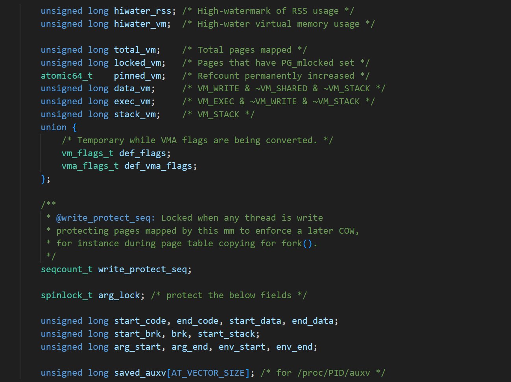

# 3进程概念

## 1冯诺依曼体系

**简单一句话：CPU只和内存打交道。综合考虑是为了效率的。**

**lesson 10**


## 2OS

**简单一句话：OS是一个软件，硬件管理的软件。通过拿到被管理者的数据进行决策。管理和被管理者不需要见面的。**

**lesson 10**


## 3先描述在组织

**管理一个对象我们需要他的那些信息？    先描述一个对象**

**管理很多个对象我们应该如何一起管理呢  全部组织起来的**


## 4什么进程

**内核数据结构+进程的代码。**

**struct task_struct 内核结构体 --> 内核结构体的对象 ---> 将该结构体和你的代码和数据关联起来----> 先描述，后组织。**

**进程 == 内核数据结构 + 进程对应的磁盘代码**


## 5见见系统调用

**id常用的接口**

**一般常用的id接口，查看自己的进程id和父进程id信号。**

**一般来说运行的程序都是当前终端的一个子进程，和linux的指令没有声明区别的。**

**示例**

```c++
#include <unistd.h>
#include <iostream>
using namespace std;

int main()
{
  cout<< "ppid:" << getppid() << endl;  // 当前进程就是bash的一个进程而已
  cout<< "pid:" << getpid() << endl;   // 进程自己的pid
  return 0;
}
```

**查看当前bash的pid指针：echo $$**


**fork函数就是创建一个新的执行流。**

**当fork开始返回的时候就开始，写时拷贝了，通过fork的返回值进行分流。**

**父进程拿到子进程的pid方便回收子进程的信息。子进程拿到0，知道自己是子进程的。**

**fork函数**

**示例：**

```c++
#include <unistd.h>
#include <iostream>
using namespace std;

int main()
{
  pid_t id = fork();
  if(id == -1)
  {
    exit(2);
  }

  if(id == 0)
  {
    cout<< "ppid:" << getppid() << ":" << "pid:" << getpid() <<endl;
  }
  else 
  {
    cout<< "ppid:" << getppid() << ":" << "pid:" << getpid() <<endl;
  }

  return 0;
}

```


## 6进程状态

**一般OS的书如何说明的呢**

**1.运行，2新建 3就绪 4挂起 5阻塞 6等待 7停止 8挂起 9死亡**

**具体到linux系统。**


### R运行状态

**只要在CUP的运行队列，不管有没有执行就是R状态的。**

**R状态一般是等待CPU资源的。**

**R状态一般是计算密集型的。**

**代码示例：**

```c++
#include <unistd.h>
#include <iostream>
using namespace std;

int main()
{
  int a = 0;
  while(true)
  {
    a += 1;
  }
  return 0;
}
```


### S阻塞状态

**linux有不同的队列，S就是阻塞状态。**

**阻塞状态的本质就是等待某种资源的就绪。**

**其他系统的阻塞和挂起可能分开，但是linux，阻塞和挂起和你用户有什么关系呢？**

**代码示例：**

```c++
#include <unistd.h>
#include <iostream>
using namespace std;

int main()
{
  int a = 0;
  while(true)
  {
    sleep(1);
    cout<< "a:" << a << endl;
  }
  return 0;
}

```

**总结：**

**阻塞状态就是对应的阻塞队列等待某种资源就绪。**


### D状态

**深度睡眠状态，不可以杀死，只能等OS自己醒过来，一般都是在磁盘高IO的情况下进行的。**

**例子后面补充的。**


###  T状态

**进程运行的时候，我们可以发送信号让它停止下来。19号信号。**

**代码示例：**

```c++
#include <unistd.h>
#include <iostream>
using namespace std;

int main()
{
  while(true)
  {
    cout<< "pid:" << getpid() << endl;
    sleep(1);
  }

  // kill -19 发送19号信号让进程停止
  // kill -18 发送18号信号让进程恢复
  // 注意恢复了，就变成后台进程了，需要kill -9才能终止的
  return 0;
}
```


### t状态

**进程调试的时候用的**

**后面补充的**


### Z僵尸状态

**僵尸状态：子进程已经退出了，等待父进程回收的这段时间一直是僵尸状态，**

**僵尸状态是一个问题，需要在进程控制的时候进程 回收的。**

**代码示例：**

```c++
#include <unistd.h>
#include <iostream>
using namespace std;

int main()
{
  pid_t id = fork();
  if(id == -1)
  {
    exit(2);
  }

  if(id == 0)
  {
    sleep(3); // 3秒后变成僵尸进程
    exit(0);
  }
  else 
  {
    while(true)
    {
      sleep(1); // 父进程一直不退出
    } 
  }

  return 0;
}
```

**僵尸状态是一个问题，需要进程处理，进程控制在回收的**


### 孤儿进程

**注意这是进程，进程，不是进程状态的。**

**代码示例：**

```c++
#include <unistd.h>
#include <iostream>
using namespace std;

int main()
{
  pid_t id = fork();
  if(id == -1)
  {
    exit(2);
  }

  if(id == 0)
  {
    while(true)
    {
      sleep(1);  // 会让OS的一号进程进行领养的
    }
  }
  else 
  {
    while(true)
    {
      sleep(1); 
      exit(1);
    } 
  }

  return 0;
}
```

**总结：linux进程会一直被兜底，让进程的资源被回收的。**


## 7进程优先级

**1.什么是优先级，有执行的权利，执行的先后顺序**

**2.为什么存在优先级，因为资源太少了**

**3.linux的优先级本质：就是PCB里面的一个整数而已。**

**top指令查看优先级。**

**进程默认优先级是80， 调整范围是 -20,19的。**


## 8其它概念

**竞争性：优先级**

**独立性：多进程运行期间，需要独享各种资源的，多进程运行期间相互独立，互不干扰。子进程和父进程关系如此亲密都无法进行干扰，其它也是如此的。**

**并行：多个进程在多个CPU下分别，同时进行运行，这称之为并行。任何时刻只能有一个>    进程正在运行。**

**并发：多个进程在一个CPU下采用进程切换的方式，在一段时间之内，让多个进程都得以>    推进，称之为并发。**

**CPU:**

**CPU很笨，只能给取指令，分析指令，执行指令。**

**CPU有很多的进程，pc寄存器，当前进程需要执行的下一条指令。**

**进程执行的时候一定会产生很多的临时数据，属于当前进程的。进去被切换的时候，需要上下文保护。进程恢复的时候，需要上下文进行恢复。**


## 9环境变量

**引入：为什么我们执行自己的指令需要  ./a.out 。为什么其他Linux指令不需要呢？ 因为存在PATH环境变量的。**

**PATH环境变量帮我们已经找到了 ，这些指令的路径。1.添加到OS的PATH指定的路径， 2.补充环境变量。我们就不需要执行 ./  。**

### 环境变量表1

**代码示例：**

```c++
#include <unistd.h>
#include <iostream>
using namespace std;

int main(int argc, char* argv[], char* env[])
{
  (void)argc;
  (void)argv;
  for(int i = 0; env[i]; ++i)
  {
    cout<< env[i] << endl;
  }

  return 0;
}

```

**总结：**

**这个不常用**


### 环境变量表2

**代码示例：**

```c++
#include <unistd.h>
#include <iostream>
#include <stdlib.h> 

using namespace std;
extern char** environ;

int main()
{
  for(int i = 0; environ[i]; ++i)
  {
    cout<< environ[i] << endl;
  }

  return 0;
}

```

**总结：**

**这个不常用**


### 环境变量表3

**代码示例：**

```c++
#include <unistd.h>
#include <iostream>
#include <stdlib.h> 

using namespace std;

int main()
{
  cout<< getenv("USER") << endl;
  cout<< getenv("PWD") << endl;
  cout<< getenv("HOME") << endl;
  cout<< getenv("PAHT") << endl;

  return 0;
}

```

**总结：**

**推荐使用，指哪打哪**


### main函数参数 

**main函数参数，可以调整程序的不同功能。**

```c++
#include <unistd.h>
#include <cstring>
#include <iostream>
#include <stdlib.h> 

using namespace std;

int main(int argc, char* argv[])
{
  if(argc != 2)
  {
    cout<< "uasge: ./a.out -a" << endl;
    exit(2);
  }
  
  if(strcmp("-a", argv[1]) ==0)
  {
    cout<< "方法a" <<endl;
  }
  else if (strcmp("-b", argv[1]) ==0)
  {
    cout<< "方法b" <<endl;
  }
  else if (strcmp("-ab", argv[1]) ==0)
  {
    cout<< "方法ab" <<endl;
  }
  else 
  {
    cout<< "方没有实现" <<endl;
  }
  return 0;
}

```

**总结：**

**main函数的参数选项就是为了实现不同的功能的。**


## 10进程地址空间

**1.实际上我们看到的进程地址空间是PCB里面的数据结构。**

**strruct mm_struct* mm 里面的属性就有的。**




**2.程序加载到内存里面天然就有了物理地址的。**

**3.进程加载到内存里面，OS为了管理，需要创建PCB。当PCB里面属性需要被填充，进程地址空间就填充到了 struct mm_struct* mm里面了的。**

​	**1.程序编译的时候，编译器和连接器会为函数，变量等安排地址的。**

​		**相对地址   虚拟地址布局  建立虚拟内存映射**  **编译 链接  加载**

​	**2.随机化进程虚拟内存布局**

​		**函数地址 全局变量地址 栈地址  堆地址**

**4.创建进程的时候根据编译好的代码布局，随机填充mm_struct。根据 物理地址进行映射的。 中间就是mmu。页表的。**


**代码示例：**

```c++
#include <iostream>
#include <unistd.h>
using namespace std;

int main()
{
  int value = 100;
  pid_t id = fork();
  if(id == -1)
  {
    exit(1);
  }
  
  if(id == 0)
  {
    while(value > 0)
    {
      cout<< "child process,value:" << value << "  &value:" << &value <<endl;
      value -= 2;
      sleep(1);
    }
  }
  else 
  {
    while(value > 0)
    {
      cout<< "paren process,value:" << value << "  &value:" << &value <<endl;
      value -= 3;
      sleep(1);
    }
  }

  return 0;
}

```

**总结：**

**这是根据编译好的相对地址进行映射的虚拟地址的。**

**虚拟地址----页表----物理地址**


