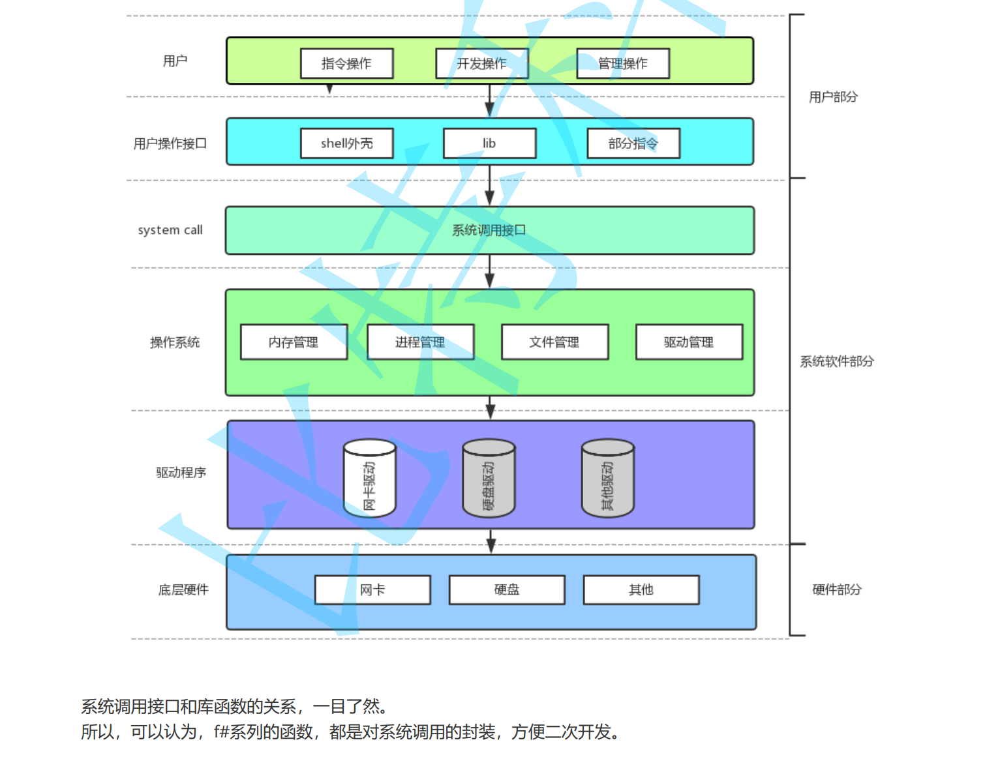
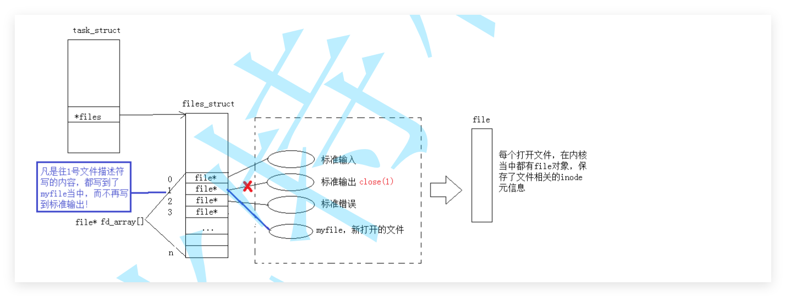

# 5基础io

## 1文件操作的本质

**重新认识文件**

**1.空文件也要占磁盘空间的**

**2.文件 = 内容 + 属性**

**3.文件操作 == 属性操作 + 文件操作 + （文件内容 + 文件属性）**

**4.标定一个文件 必须使用 文件名+路径  唯一性**

**5.如果没有指定文件的路径，默认是当前路径访问文件。进程当前路径的。**

**6.OS接口，代码编译完成之后，形成的可以执行文件，但是没有运行，文件对应的操作没有被执行的。**

**7.一个文件没有被打开，可以直接访问吗？不可以的，一个文件要被访问，必须被进程打开的。**

**总结：**

**文件操作：进程和被打开文件的关系。**


## 2从谈文件操作

**1.c语言，c++，java, python, php, go , shell? 操作接口都不一样的**

 	**文件在哪里呢>>>>磁盘--》硬件---》os---》所有人想访问磁盘，都不能绕过os---》》使用os提供的接口--》可以，操	作    系统只有一个**

​	**---》上层语言无论如何变化，**

​	**a库函数必须 调用 系统调用接口**

​	**b库函数可以千变万化，但是底层不变--- 如何降低学习成本呢？**

**2.操作**

**c语言**

**r:只读打开，文件必须存在的。 r+:读写打开，文件必须存在的。**

**w:写文件打开，文件不存在就创建，存在则清理的。w+读写打开，每次都是新的写入。**

**a:向文本追加写入，文件不存在则创建，存在则不管，a+追加文件，每次都是新的追加**


### 1.标记位传参


### 2.fopen接口

**fopen: r只是读，文件必须存在的。w写文件，文件不存在就创建的，新的写入。a追加文件，文件不存在就创建的，都是一次追加的。**

**fopen: r+读写，文件必须存在的。w+读写，文件不存在就创建的，新的写入。a+读写，文件不存在就创建的，都是一次追加的。**


**3.fgetc接口**

**代码示例**

```c
#include <stdio.h>

int main()
{
    FILE* fp = fopen("test.txt", "r");

    if(fp == NULL)
    {
        perror("fopen");
        return 1;
    }

    int ch;

    while((ch = fgetc(fp)) != EOF)
    {
        putchar(ch);
    }

    fclose(fp);

    return 0;
}
```

**注意读取文件的时候，注意文件指针的位置的。**


### 4.fgets接口

```c
#include <stdio.h>

int main()
{
    FILE* fp = fopen("test.txt", "r");

    if(fp == NULL)
    {
        perror("fopen");
        return 1;
    }

    char buf[1024];

    while(fgets(buf, sizeof(buf), fp) != NULL)
    {
        printf("%s", buf);
    }

    fclose(fp);

    return 0;
}
```

**1.读到 \n  **

**2.会自动填充零的。**


## 3系统接口


## 4系统文件I/O

**umask函数：当前进程的文件掩码。虽然他们是按位取反什么的。怎么感觉直接个减法就行了的。**

**open函数常用的宏**

**O_RDONLY:  只读打开**

**O_WRONLY:只写打开**

**O_RDWR:读写打开**

**O_CREAT:文件不存在，则创建，需要使用modet选项知名文件的权限。**

**O_APPEND:追加文件。**

**O_TRUNC:清除文件的内容，重新写的。**


**系统函数和语言函数的区别**

**c语言函数，本质上是对系统函数的封装。**




## 5文件描述符fd

**linux文件描述的本质就是数组的下标。**

**最小原则：从零开始最小没有被分配的，就是新打开的。一个进程默认打开 0标准输入，1标准输出，2错误输出。**

**files_struct，里面有数组。file* fd_array[] 。**



```c++
#include <iostream>
#include <unistd.h>
#include <stdlib.h>
#include <cstdio>
#include <sys/types.h>
#include <sys/stat.h>
#include <fcntl.h>
using namespace std;

int main()
{
  umask(0);
  cout<< "stdin:" << stdin->_fileno << endl;
  cout<< "stdou:" << stdout->_fileno << endl;
  cout<< "stderr:" << stderr->_fileno << endl;
  
  close(0);

  int fd = open("licher", O_RDWR | O_CREAT, 0666);
  if(fd == -1)
  {
    perror("open");
  }
  cout<< "fd:" << fd <<endl;
  return 0;
}

```


## 6dup2接口

**`dup2(oldfd, newfd)` 会让 `newfd` 指向与 `oldfd` 完全相同的文件，相当于给一个打开的文件起了个“别名”。**

**如果 `newfd` 之前已经打开，它会先被自动关闭，然后再进行复制。**

```c
#include <stdio.h>
#include <sys/types.h>
#include <sys/stat.h>
#include <fcntl.h>
#include <unistd.h>
#include <string.h>

#define METHON 2
#define OPT 2


int main()
{
  if(METHON == 1)
  {
#if OPT == 0
    close(0);

#elif OPT == 1
    close(1);

#elif OPT == 2
    close(2);

#endif
    umask(022);
    int fd = open("log.txt1", O_RDWR | O_APPEND | O_CREAT, 0666);
    if(fd == -1)
    {
      perror("open");
      return 1;
    }

    printf("fd:%d\n", fd);
  }
  else 
  {
    umask(022);
    int fd = open("log.txt1", O_RDWR | O_APPEND | O_CREAT, 0666);
    if(fd == -1)
    {
      perror("open");
      return 1;
    }

#if OPT == 0
    dup2(fd, 0);
    char buffer[1024] = {0};
    ssize_t n = read(fd, buffer, sizeof(buffer) - 1);
    if(n > 0)
    {
      buffer[n] = 0;
    }
    printf("%s\n", buffer);

#elif OPT == 1
    dup2(fd, 1);
    const char* name = "lichermionexTTTTTTTTTTTTT\n";
    write(fd, name, strlen(name));

#elif OPT == 2
    dup2(fd, 2);
    const char* name = "lichermionex---erron\n";
    write(fd, name, strlen(name));
      
#endif
    close(fd);
  }

  return 0;
}
```


## 7动静态库

### 静态库

**linux下静态库长什么样子：libxxx.a。本质上就是一堆 .o文件打包到一起的。**

**静态库：对个.o文件的压缩包。**

**它不会在程序运行时被加载，而是在**链接阶段**把需要的代码拷贝进最终可执行程序。**

**制作库的指令：archiver。归档器。**

```
ar      用来制作静态库的工具
-r      replace，把目标文件插入到库中
-c      create，如果库不存在就创建
libmymath.a   静态库名字
add.o sub.o   要打包进去的目标文件

```

```
ar -t libmymath.a
输出
add.o
sub.o
```

```
nm libmymath.a
输出
add.o:
0000000000000000 T Add

sub.o:
0000000000000000 T Sub
```

```
gcc main.c -L. -lmymath -o main
-L.        在当前目录查找库文件
-lmymath   链接 libmymath.a
-o main    生成可执行程序 main
```

```
gcc -c add.c -o add.o
gcc -c sub.c -o sub.o

ar -rc libmymath.a add.o sub.o

gcc main.c -L. -lmymath -o main
```

```
static_lib_test/
├── include/
│   ├── add.h
│   └── sub.h
├── src/
│   ├── add.c
│   └── sub.c
├── lib/
│   └── libmymath.a
└── main.c
```

```
gcc main.c -Iinclude -Llib -lmymath -o main
-Iinclude   去 include 目录找头文件
-Llib       去 lib 目录找库文件
-lmymath    链接 libmymath.a
```

```
1. 源文件 .c 编译成 .o
2. 使用 ar 工具把多个 .o 打包成 .a
3. 编译主程序时通过 -L 指定库路径，通过 -l 指定库名
4. 链接器会从静态库中提取需要的目标代码，合并到最终可执行程序中
```

```
静态库是在链接阶段被拷贝进可执行程序的库。
```

 **静态库总结：**

**1制作.o文件：gcc -c add.c -o add.o**

**2打包.文件：ar -rc libmymath.a add.o sub.o**

**3使用静态库需要知道三个东西 ：gcc main.c -Iinclude -Llib -lmymath -o main**

​	**使用静态编译代码：I头文件的位置，-L库文件的位置，-l库文件的名称。**

**其实也不需要记忆：include lib 库名称。**


### 动态库

```
静态库 .a：链接时拷贝进可执行程序
动态库 .so：运行时再加载
```

```
gcc -fPIC -c add.c -I ../include -o add.o
gcc -fPIC -c sub.c -I ../include -o sub.o
生成位置无关代码 Position Independent Code
```

```
gcc -shared add.o sub.o -o libmymath.so
libmymath.so
```

```
shared_lib_test/
├── include/
│   ├── add.h
│   └── sub.h
├── src/
│   ├── add.c
│   └── sub.c
├── lib/
│   └── libmymath.so
└── main.c

gcc -fPIC -c src/add.c -Iinclude -o add.o
gcc -fPIC -c src/sub.c -Iinclude -o sub.o

gcc -shared add.o sub.o -o lib/libmymath.so

gcc main.c -Iinclude -Llib -lmymath -Wl,-rpath=./lib -o main
```

| 对比项         | 静态库 `.a`              | 动态库 `.so`                   |
| -------------- | ------------------------ | ------------------------------ |
| 链接阶段       | 把代码拷贝进可执行程序   | 只记录依赖关系                 |
| 运行阶段       | 不需要库文件             | 需要找到 `.so` 文件            |
| 可执行程序大小 | 较大                     | 较小                           |
| 更新库         | 需要重新链接程序         | 可以只替换 `.so`               |
| 部署           | 简单，只有一个可执行程序 | 需要带上 `.so`                 |
| 常见命令       | `ar -rc libxxx.a *.o`    | `gcc -shared *.o -o libxxx.so` |

1. 使用 gcc -fPIC -c 生成位置无关的 .o 文件
2. 使用 gcc -shared 生成 .so 动态库
3. 编译主程序时通过 -L 指定库路径，通过 -l 指定库名
4. 运行程序时，系统动态链接器需要找到对应的 .so 文件


