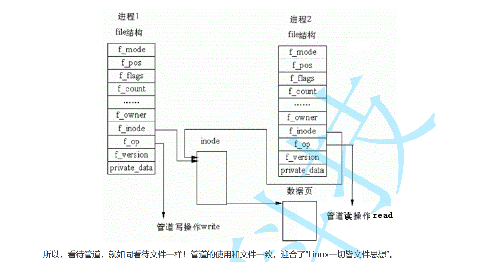

# 6进程间通信

**1.进程具有独立性，进程通信的成本一定不低的。**

**2.进程通信的本质是让不同的进程看到同一份的资源。**


## 1.管道

### 1匿名管道

**匿名管道这里就是OS维护的一块内存。**

**代码示例：**

```c++
#include <unistd.h>
#include <sys/types.h>
#include <sys/wait.h>
#include <cstring>
#include <iostream>
using namespace std;

int main()
{
// 1.创建一个匿名管道的文件,注意没目的是让子进程继承下去的。
  int fds[2] = {0};
  int n = pipe(fds);
  if(n == -1)
  {
    perror("pipe");
    return -1;
  }

// 2.创建子进程，子进程会继承父进程的文件描述符的。
  pid_t id = fork();
  if(id == -1)
  {
    perror("fork");
    return -2;
  }

// 3.匿名管道是半双工，只能一个方向进行通信的。
  if(id == 0)
  {
    // 3.1子进程继承了读端和写端的，这里我们关闭0,就是关闭读端。
    close(fds[0]);
    char buf[1024] = {0};

    int i = 10;
    while(i)
    {
      snprintf(buf, sizeof(buf) - 1, "我是子进程，这是倒数第几次消息:%d\n", i);
      write(fds[1], buf, strlen(buf));
      i--;
    }
    
    // 关闭写端，防止文件描述符浪费的
    close(fds[1]);
    sleep(22);
    return 12;
  }
  
  // 3.2父进程我能关闭的是写端
  close(fds[1]);
  char buf[1024];
  while(true)
  {
    sleep(1);
    int n = read(fds[0], buf, sizeof(buf) - 1); 
    if(n == 0)
    {
      cout<< "子进程已经书写完毕了" <<endl;
      break;
    }
    buf[n] = '\0';
    cout<< buf << endl;
  }
 
// 4.回收子进程，一般就是子进程的信号和退出码
  int status = 0;
  int ret =  waitpid(id, &status, 0);
  if(ret == -1)
  {
    perror("waitpid");
    return -1;
  }

  if(WIFEXITED(status))
  {
    cout<< "exit_code:" << WEXITSTATUS(status) << endl;
  }
  if(WIFSIGNALED(status))
  {
    cout<< "sig_number:" << WTERMSIG(status) << endl;
  }

  return 0;
}

```

**总结**

**1.创建匿名管道。然后创建子进程。**

**2.各自关闭不需要的文件描述符，然后通信的。**


### 2.文件描述符角度理解

**1.进程的PCB里面有**

```
fd* fd_array[]
tty:0
tty:1
tty:2
fds[0]
fds[1]
```

**2.当创建一个子进程的时候，子进程会进程父进程的文件描述符表。 通过PCB继承下一去的**

```
父进程的                     子进程的
fd* fd_array[]             fd* fd_array[]
tty:0                      tty0
tty:1                      tty1
tty:2                      tty22
fds[0]                     fds[0]
fds[1]                     fds[1]
```

**3.父进程子进程写**

```
父进程的                     子进程的
fd* fd_array[]             fd* fd_array[]
tty:0                      tty0
tty:1                      tty1
tty:2                      tty22
fds[0]x(关闭)               fds[0]
fds[1]                     fds[1]x(关闭)
这里写                      这里接收
```


### 3内核角度理解




### 4管道的特点

**默认阻塞模式：关闭**

​	**读管道：若管道为空，`read()`会阻塞直到有数据写入。**

​	**写管道：若管道已满，`write()`会阻塞直到有数据被读出。**

**非阻塞模式**

​	**读空管道：`read()`立即返回-1，并设置`errno`为`EAGAIN`（或`EWOULDBLOCK`）。**

​	**写满管道：`write()`也返回-1，`errno`为`EAGAIN`。**

### **管道关闭后的行为**

​	**写端关闭：读端在读完剩余数据后，下次`read()`返回0（表示文件结束）。**

​	**读端关闭：写端进程收到`SIGPIPE`信号（默认终止进程），`write()`返回-1，`errno=EPIPE`。**


## 1.1命名管道


## 2.共享内存


## 3.消息队列


