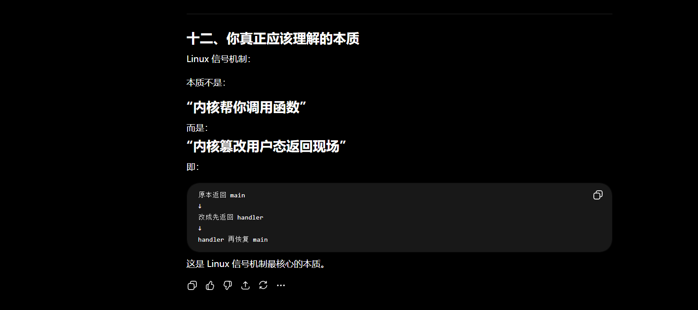

# 7进程信号

## 1初始信号

**1.产生的信号，进程能够识别到**

**2.信号到来的时候，不一定，马上进行处理的。**

**3.信号来了，需要进行保存，合适的时候进行处理的。**

​	**信号保存在哪里呢？进程PCB里面的，1-31只需一个32位的    unit的位图进行保存即可。**

**4.处理的动作：默认动作，自定义动作，忽略动作。**

**示例：**

```c++
#include <signal.h>
#include <unistd.h>
#include <iostream>
using namespace std;

void hander(int signo)
{
  cout << "捕捉到信号:" << signo << endl;
  exit(12);
}

int main()
{
// 对2号信号进行捕捉，填充PCB:指向的信号处理方法的函数指针数组。
  signal(2, hander);
  while(true)
  {
    sleep(1); 
    cout << "i a runing, pid:" << getpid() << endl;
  }
  
  return 0;
}
```

**总结：**

**对2号信号进行捕捉了，自定义的动作是:打印语句然后退出了。**

**2号信号的宏：SIGINT。 CTRL + C即可发送的。**


## 2kill接口

**Linux的kill指令本质就是 封装了kill接口的。**

**所以我们封装一下kill，就只能是类似系统的一个指令的，用来发信号给其它进的。**

**示例：**

```c
#include <signal.h>
#include <unistd.h>
#include <iostream>
using namespace std;

int main(int argc, char* argv[])
{
  if(argc != 3)
  {
    cout<< "usage: ./a.out pid signumber" << endl;
    exit(3);
  }

  pid_t id = atoi(argv[1]);
  pid_t sig = atoi(argv[2]);
 
// kill函数这里模拟实现的是，linux的值 kill指令的
  int n = kill(id, sig);
  if(n == -1)
  {
    perror("kill");
    exit(2);
  }

  return 0;
}

```

**总结：**

**kill函数，只要知道进程的pid，你就可以发送任意的信号的。**


## 3raise接口

**raise就是自己给自己发送信号，自己也可进行捕捉的**

**示例：**

```c++
#include <signal.h>
#include <unistd.h>
#include <iostream>
using namespace std;

void hander(int signo)
{
  cout << "捕捉到信号:" << signo << endl;
  exit(12);
}

int main()
{
// 对2号信号进行捕捉，填充PCB:指向的信号处理方法的函数指针数组。
  signal(2, hander);
  while(true)
  {
    sleep(1); 
    cout << "i a runing, pid:" << getpid() << endl;
    
    raise(2);
  }
  
  return 0;
}

```

**总结：**

**raise简单接口，自己给自己发送信号的。**


## 4abort

**kill指定进程发信号**

**raise给自己发信号**

**abort自己给自己发指定的信号，信号：6**

**示例：**

```c++
#include <signal.h>
#include <unistd.h>
#include <iostream>
using namespace std;

void hander(int signo)
{
  cout << "捕捉到信号:" << signo << endl;
  exit(12);
}

int main()
{
// 对2号信号进行捕捉，填充PCB:指向的信号处理方法的函数指针数组。
  signal(6, hander);
  while(true)
  {
    sleep(1); 
    cout << "i a runing, pid:" << getpid() << endl;
    
    abort();
  }
  
  return 0;
}

```

**总结：**

**kill---raise---abort。选择合适的场景进行选择即可。**


## 5硬件异常产生信号

**1.目前看到信号都是终止进程的，但是注意，信号的类型是不一样的，处理方式一样的。**

**2.CPU里面有很多的寄存器，其中有一个标志位溢出的寄存器。用来判读计算的结果是不是很大的。 有可能每次进程切换的时候，这个标志位一直都是1。**

​	**所以有时候会一直捕捉到这个信号，一直进行处理的。**

**3.进程这么知道我异常了呢？ OS知道CUP的寄存器出现了问题，给你PCB信号位 置1了的。 OS大于天，什么都知道的。**

**4.OS这么知道我野指针了，MMU出现了异常，马上给进程发信号的。**

**示例：**

```c++
#include <signal.h>
#include <unistd.h>
#include <iostream>
using namespace std;

void hander(int signo)
{
  cout << "捕捉到信号:" << signo << endl;
  exit(12);
}

int main()
{
  // 标志位溢出是8号信号的
  signal(SIGFPE, hander);
  while(true)
  {
    sleep(1); 
    cout << "i a runing, pid:" << getpid() << endl;
    
    int a = 10;
    a /= 0;
  }
  
  return 0;
}

```

**总结：**

**这里的硬件异常就是 CPU的寄存器出现了，给OS知道了，然后给你进程了的。**


## 6软件异常

```c++
#include <stdio.h>
#include <unistd.h>
#include <signal.h>
#include <stdlib.h>
#include <string.h>
#include <sys/wait.h>

void handler(int signo)
{
    printf("catch signal: %d\n", signo);

    if(signo == SIGPIPE)
    {
        printf("pipe broken!\n");
    }
}

int main()
{
    signal(SIGPIPE, handler);

    int fd[2];

    pipe(fd);

    pid_t pid = fork();

    if(pid == 0)
    {
        // child
        close(fd[1]);

        char buf[128];

        read(fd[0], buf, sizeof(buf));

        printf("child recv: %s\n", buf);

        close(fd[0]);

        exit(0);
    }
    else
    {
        // parent
        close(fd[0]);

        sleep(1);

        write(fd[1], "hello", 5);

        sleep(2);

        printf("child already quit\n");

        // 子进程已经关闭读端
        // 再写会触发 SIGPIPE
        write(fd[1], "world", 5);

        wait(NULL);
    }

    return 0;
}
```


## 7alarm信号

**现在我们可以指定时间给进程发送一个时钟的信号了**

**alarm信号：14信号的**

**看看访问io和计算密集型的区别，就知道外设多慢了的。**

**IO密集型：**

```c++
#include <signal.h>
#include <unistd.h>
#include <iostream>
using namespace std;

int cnt = 0;
void hander(int signo)
{
  cout << "捕捉到信号:" << signo << endl;
  exit(12);
}

int main()
{
  signal(SIGALRM, hander);
  alarm(1);
  while(true)
  {
    cout<< "cnt:" << cnt++ <<endl;
  }
  
  return 0;
}
// **95000次**
```

**计算密集型：**

```c++
#include <signal.h>
#include <unistd.h>
#include <iostream>
using namespace std;

int cnt = 0;
void hander(int signo)
{
  cout << "捕捉到信号:" << signo << endl;
  cout << "cnt:" << cnt << endl; 
  exit(12);
}

int main()
{
  signal(SIGALRM, hander);
  alarm(1);
  while(true)
  {
    cnt++;
  }
  
  return 0;
}
// cnt:579588300
```

**总结：**

**时钟信号类似sleep的功能的。**


## 8核心转储

**方便我们进行调试的。**


## 9信号：抵达，阻塞，未决

**1. 产生信号，放在pending表里面的， 没有被阻塞，信号抵达了的。**

**2.产生信号，放在pending表里面的，被阻塞了，留在pending表里面了的，等待被解除了，然后抵达的。**

**3.被阻塞的信号在产生后，通常会长期处于未决状态**

```c
 struct task_struct
 {
   // pending位图
   unsigned int pending = 0;  // 0000 0000  0000 0000  0000 0000  0000 0000 1.比特位的位置，信号编号。2.比特位的内容，是否，收到了对应的信号
    // block位图
    unsigned int block = 0;    // 0000 0000  0000 0000  0000 0000  0000 0000 2.比特位的位置，信号编号。2.比特位的内容，是否，阻塞了对应的信号
    hander_t hander[32];      //  函数指针数组，a数组的位置(下标)，信号的编号，b数组下标对应的内容，表示对应信号的处理方法
 }
```

**1. pending表置1，信号已经抵达了，检查阻塞表，阻塞了，信号一直在penging表里面了的。**

**2.pending表置1，信号已经抵达了，检查阻塞表，没有阻塞，信号抵达了。**

**3.信号的pending表和block表只有OS有能力进行修改的。**


## 10信号处理的时候

**信号产生的流程：**

**信号产生的时候，不会立即处理的，而是在合适的时候。从用户态返回内核态的时候，进行处理的。**

**OS是一个进行软件，硬件管理的软件。**

**1.用户态到内核态。1.OS系统自身的资源：getpid(), waitpid(), 2.硬件资源 printf(), read(), write()。**

**2.为了用户能够访问内核资源或者硬件资源，必须通过系统调用，完成访问。 printf底层还是封装了系统的接口的。**

​	**访问硬件的资源。 IO和内存。**

**内核态:用户态变成用户态的时候，调用系统调用。实际执行系统调用的进程，但身份其实是内核。 往往系统调用比费**

**时间。尽量避免频繁调用系统调用。**

**上下文的切换**

**1.CPU存在课件寄存**

**2.CPU存在不可见寄存器**

**3.凡是和进行强相关的，就是上下文件数据的。**

**CR3寄存器：0内核态，3用户态。**


**用户态如何切换到内核态？**

**进程地址空间登场3-4G。内核级页表存在一份，当一个进程load到内存的时候，每一个进程3-4都分配内核级页表的。**

**进程需要访问OS接口，只需要在自己的进程地址空间进行跳转就行了的。**

**系统接口其实位置，Int80陷入内核，内核态，执行内核的代码。**


**信号产生的时候，我们不会马上进行处理的，而是在合适的时候，用用户态返回到内核态的时候。**

**曾经我们一定是先进入内核态！ 系统调用，进程切换，**

**当我们注册自己的放到的时候，就是给PCB信号方法的函数指针数组填充自己的函数地址。**


**我们能不能用内核执行用户态的代码呢？不能，谁知道你写的什么代码呢？**


## 11信号集操作

**接口**

```c
int sigemptyset(sigset_t* set) // set全部置零
int sigfillset(sigset_t* set)  // set全部置一，set指向的集合
int sigaddset(sigset_t* set, int signo); // 添加信号
int sigdelset(sigset_t* set, int signo); // 删除信号
int sigismember(const sigset_t*, int signo); // 判断signo是不是在里面的
```

```c
int sigprocmask(int how, const sigset_t* set, sigset_t* oset); 
// SIG_BLOCK 屏蔽当前信号
// SIG_UNBLOCK 屏蔽解除阻塞
// SIG_SETMASK 

int sigpending(sigset_t* set);  // 读取当前未决的信号
```

```c++
#include <signal.h>
#include <unistd.h>
#include <iostream>
using namespace std;

void hander(int signo)
{
  cout << "捕捉到信号:" << signo << endl;
}

// 0000 0000 ... 0000 0000 
// 后面的才是123信号的。
void print_pending(sigset_t& pending)
{
  for(int i = 31; i >= 1; i--)
  {
    if(sigismember(&pending, i))
    {
      cout<< 1;
    }
    else 
    {
      cout<< 0;
    }
  }
  cout<<endl;
}

int main()
{
// 1.自定义捕捉2号信号的处理。
  signal(2, hander); 
  
// 2.指定需要屏蔽的信号
  sigset_t block, oblock, pending;

// 3.清理
  sigemptyset(&block);
  sigemptyset(&oblock);
  sigemptyset(&pending);

// 4.添加屏蔽的信号
  sigaddset(&block, 2);


// 5.设置进内核里面
  
  // block里面已经对2号信号进行设置了的。
  // 如果2号信号来了，会在pending表里面的。
  // oblock里面全都是零的。
  sigprocmask(SIG_SETMASK, &block, &oblock);
  // SIG_SETMASK set =   block 
  // SIG_BLOCK   set |=  block 
  // SIG_UNBLOCK set &= ~block

// 看看我们的信号是否真的设置进内核了的
  int cnt = 0;
  while(true)
  {
    // 输出型参数，看看pending表是否有数据的,阻塞了的数据不会抵达的，就在pending里面的。
    sigpending(&pending); 
    // 打印pending表的，注意pending表示从后面才是1号信号的。
    print_pending(pending);   
    sleep(1);
    cnt++;

    // 5秒后解除阻塞的
    // 解除阻塞后马上抵达的。
    if(cnt == 5)
    {
      sigprocmask(SIG_SETMASK, &oblock, &block);
    }
  }
  
  return 0;
}
```


## 12sigaction操作

```c
int sigaction(
    int signum,
    const struct sigaction *act,
    struct sigaction *oldact
);

struct sigaction
{
    void     (*sa_handler)(int);                        // 一般的hander
    void     (*sa_sigaction)(int, siginfo_t *, void *); // 高级版的hander
    sigset_t sa_mask;                                   // 需要屏蔽掉的信号
    int      sa_flags;                                  // 一些标志位的 
};
```

```c++
#include <signal.h>
#include <unistd.h>
#include <iostream>
using namespace std;

void hander(int signo)
{
  cout << "捕捉到信号:" << signo << endl;
}

int main()
{
  struct sigaction act, oact;
  act.sa_handler = hander;
  act.sa_flags = 0;
  sigemptyset(&act.sa_mask);
  sigaddset(&act.sa_mask, 3); // 屏蔽3号信号的

  sigaction(SIGINT, &act, &oact);
  while(true)
  {
    std::cout<< "process runing...." << std::endl;
    sleep(1);
  }

  return 0;

}

```

**总结：**


## 13信号总结

**1.信号的流程**

**1.1  信号产生(硬件软件产生)------信号保存--------信号抵达处理。**

**2.信号产生了，信号没有被阻塞，直接抵达了。**

**3.信号产生了，信号被阻塞了，保存在pending表里面了， 当解除了阻塞，信号抵达了。**

**4 block pending 00 信号没有来，也没有阻塞。 11信号来了被阻塞了存在pending表。，10信号没来被，01信号来了，没有阻塞，直接抵达了的。**


**1.pending表：信号收到了，但是还么有进行处理的**

**2.block表：哪些信号暂时不允许抵达的**

**3.hander表：每个信号对应的处理动作： 默认，忽略，自定义。**

```
信号产生
    ↓
写入 pending
    ↓
检查 block
    ↓
若未阻塞 -> 立即递达
若阻塞   -> 留在 pending
```

**pending表的意义：先记录“信号已经来过”**

**block表的意义：目前我还有更重要的事情处理的。**


**linux的pending和block的位图处理**

```
pending & ~blocked
pending 110  
block   101  ~block 010

pending & ~block == 110 & 010 = 1 只有中间的可以抵达的
```


**用户态和内核态**

**信号来了不是马上处理的，和的时候，从内核态返回用户态的时候执行的。**

```
用户态运行
    ↓
发生系统调用 / 中断 / 异常
    ↓
进入内核态
    ↓
内核发现有可递达信号
    ↓
修改用户态返回现场
    ↓
iret/sysexit 返回用户态
    ↓
不是回原代码
而是先执行 signal handler
    ↓
handler 执行完
    ↓
再恢复原用户态代码
```


**1.用户态执行代码**

**2.产生信号，信号保存起来。**

**3.进程进入内核态的情况：系统调用，时钟中断，页异常，IO中断。CPU从用户态切换到内核态的。**

**4.切换到内核态时发生什么：进程地址空间3-4G.**

```
RIP
RSP
RFLAGS
CS
SS
寄存器
```

**trapframe（中断现场） “未来回用户态所需的信息”**

**5.内核检查信号。pending & ~blocked**

**6.最关键的部分. 内核不会直接调用 handler  在内核态直接执行用户代码  修改“返回用户态的现场”    **

**7.  RIP = main里的某行代码 --- RIP = signal handler.**

**8.返回用户态。**

**信号的本质：也是就是一个无穷大的信号**




## 14接口总结

**前面已经有代码，接下来总结一遍方便复习。**

**signal函数，实现对信号的自定义方法，也不是任何信号都能够进行捕捉的。**

```c
typedef void (*sighandler_t)(int);
sighandler_t signal(int signum, sighandler_t handler);
// signal() returns the previous value of the signal handler, or SIG_ERR on error.  
// In the event of an error, errno is set to indicate the cause.
```


