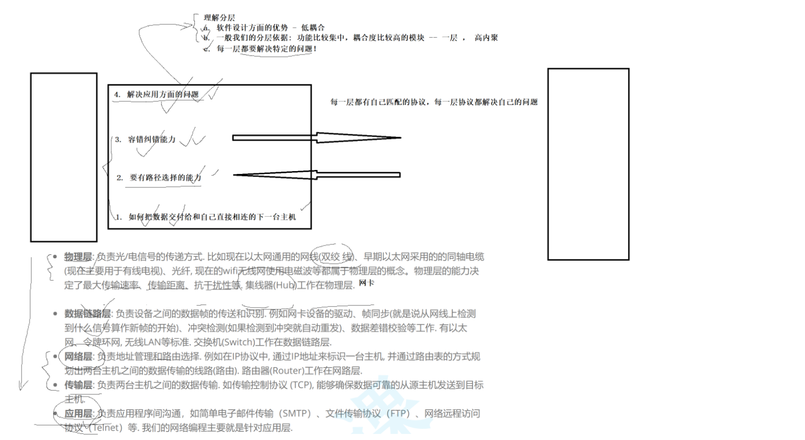
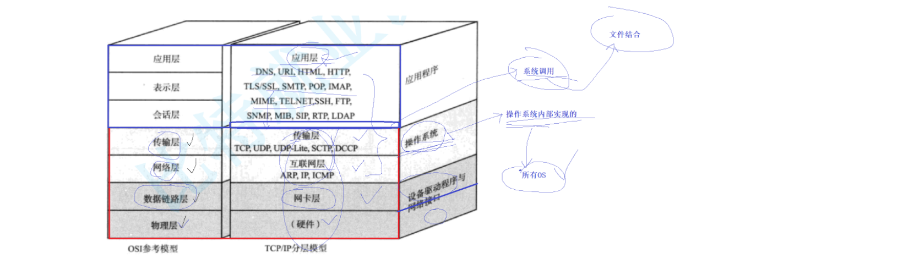
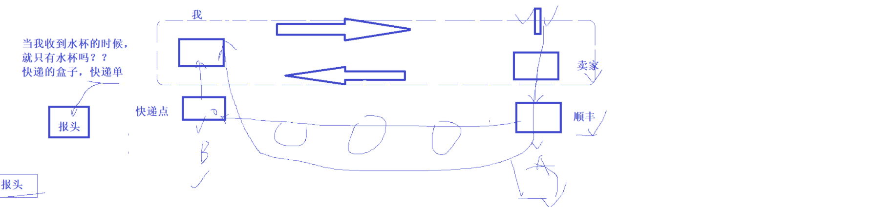
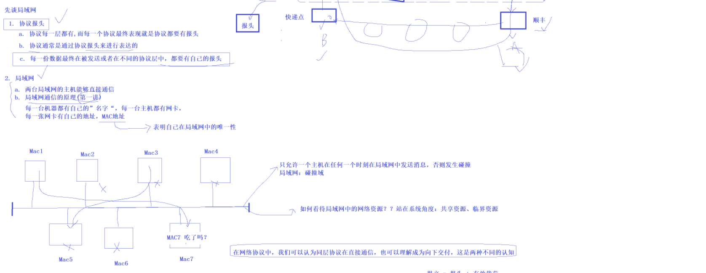
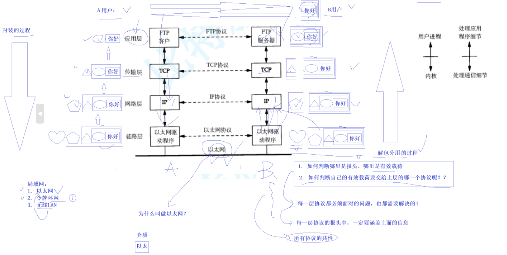
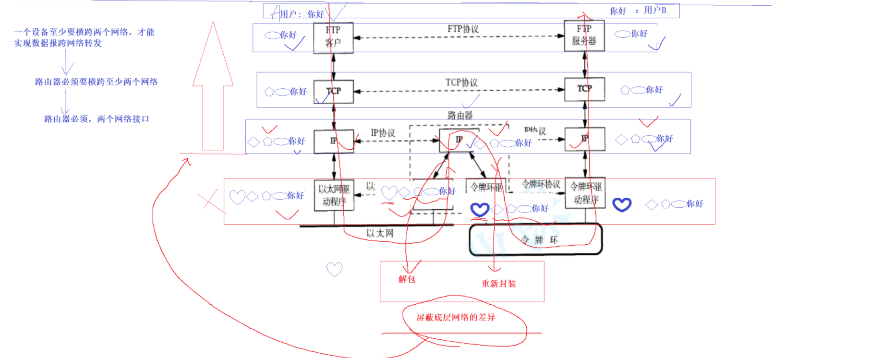
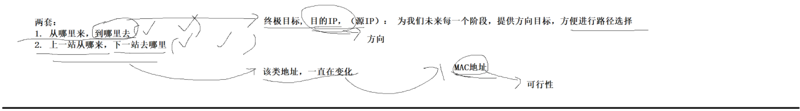
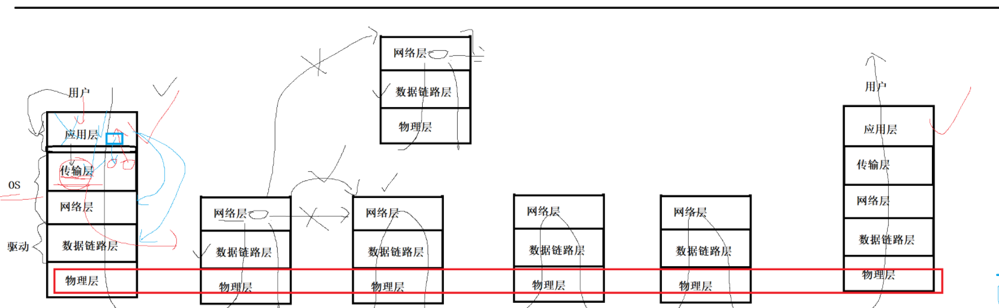
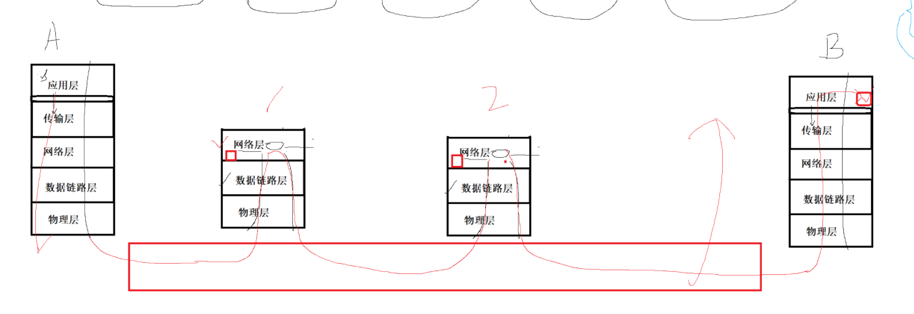

# 9网络基础1

## **lesson 40**

## 1.协议

**协议的本质是一种约定。一台计算机内部本质也是一个小型的网络。协议让通信双方减少通信的成本。**

**计算器体系结构中有网络，网络中有计算机体系结构。**

**近距离通信，障碍比较少，不容易出错。**

**距离边长，可能会引入新的通信问题。尽可能减少通信成本，定制协议。**

**为什么会存在协议？ 所有的网络问题：本质都是传输距离变长了。**

**协议就是约定。**

## 2.软件分成

**分层的意义：**

**1.软件设计方面的优势：低耦合。**

**2.一般我们的分层依据：功能比较集中的，耦合度比较高的模块，设置为一层。高内聚。**

**3.每一层都有解决特定的问题。**

**主机1                                                   主机2**

**1.如何把数据交付给和自己直接相连的下一台主机。**

**2.路径选择的能力。（别送错了的）**

**3.容错的能力。（万一送错了）**

**4.解决应用方面的问题。（送到目的地是手段）**

**上面的每一层，都有自己匹配的协议，每一层协议都解决自己的问题。**

**OSI七层模型**

**Open System Interconnection**

**7.应用层 **

**6.表示层**

**5.会话层**

**4.传输层                 两个节点之间的数据选择**

**3.网络层                 路径选择**

**2.数据链路层         互链设备**

**1.物理层               硬件方面**

**TCP/IP协议（四层或者五层）**

**1.物理层      Hub层（集线器） ，信号方法。 光猫：数字信号到模拟信号----模拟信号到数字信号。 网络：接收数据的。**

**2.数据链路层    交换机**

**3.网络层         路径选择**

**4.传输层         容错能力**

**5.应用层       拿到数据，如何解决（会话，表示，应用）**

## 3局域网

**协议报头**

**a.协议每一层都有，而每一个协议的最终表现：就是协议 要有报头。**

​	**收快递的时候，不止快递（还有盒子和快递单子）  快递单就是报头   盒子就是打包的数据**

​	**快递单的意义：报头的意义。**

**b.协议通常是：通过协议报头老进行表达的。**

**c.每一份数据最终被 发送， 或者在不同的协议层， 都要有自己的报头。**

**d.送到目的地是手段，使用才是目的。**

**e.说明书才是应用层的协议**

**总结：每一层都要有自己的协议报头。**

**局域网：**

**a.两台局域网的主机能够直接通信。**

**b.局域网通信的原理（第一讲）**

​	**每一台机器都有自己的名字，每一台主机都有网卡，每一张网卡都有自己的地址，MAC地址**

​	**MAC地址标明自己在局域网中的唯一性。。**

**局域网通信**

**不断添加报头，封装的过程**

**应用层+1**

**传输层+2**

**网络层+3**

**链路层+4**

**不断删除报头，解包分用的过程**

**链路层+4-1**

**网络层+3-1**

**传输层+2-1**

**引用层+1-1**

**报文=报头+有效载荷**

**有效载荷交给上层**

**在网络协议当中，我们可以认为同层协议在直接通信，也可以理解成，向下交付。这是两种不同的认知。**

**几乎每一层协议都必须面对的，也都需要解决的**

**1.如何识别哪里是报头，那里是有效载荷？**

**2.如何判断自己的有效载荷要交给上层的哪一个协议呢？**

**每一层协议的报头中，一定要涵盖上面的信息**

**上面是所有协议的共性。**

**局域网：**

**1.以太网**

**2.令牌环网:令牌发数据，类似锁。**

**3.无线LAN:**

**局域网，只允许一个主机在任何时刻在局域网中发送信息，否则碰撞。**

**局域网：碰撞域**

**如何看待局域网中的网络资源？？站在系统角度，共享资源 临界资源。**

**以太网**

**Ethernet**

**一个设备至少要横跨两个网络，才能实现数据跨网络转发。**

**路由器必须的至少横跨两个网络。**

**路由器必须，两个网络接口。**

**路由器：解密一层，再加密一层。**

**ip层存在的意义：屏蔽底层网络的差异。**

## lesson41

**复习**

**协议就是一种约定**

**分层结构，分层高内聚，底耦合。**

**添加协议报头。解包和分用。**

**局域网通信的原理**

**跨网络通信：通过路由器，屏蔽底层协议。**

**报头和有效载荷。**

**IPV4:AMERICAN**

**IPV6:CHINA**

**ipv4:32位。点分十。**

**两套：**

**1从哪里来，到哪里去。           终极目标，目的ip(源IP)。未来每一个阶段，提供方向目标，方便进行路径选择。   方向**

**2上一站从哪里来，下一站去哪里。  该类地址，一直在变化。MAC地址。                                        可行性**

**IP地址：**

**IP地址是在IP协议中, 用来标识网络中不同主机的地址;**

**MAC地址：**

**MAC地址用来识别数据链路层中相连的节点**

**传输层和网络层在OS里面。**

**MAC地址一值变化的**

**IP地址A                           IP地址B**

**应用层                            应用层**

**传输层       MAC1       MAC...    传输层**

**网络层      网络层                网络层**

**数据链路层  数据链路层    ...      数据链路层**

**物理层      物理层                物理层**

**下           上下        ...      上**

**数据都必须在物理层上面跑**

