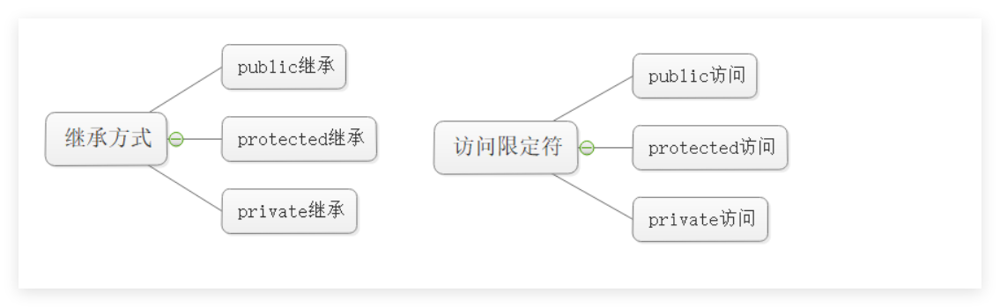

# c++继承

## 1继承的概念及定义

### 1.1继承的概念

**继承是代码复用的手段。设计层次方面的。在原有的对象上进行扩展。新类叫做派生类。**

```c++
#include <iostream>
#include <string>
using namespace std;

class person
{
public:
  void print()
  {
    cout<< "name:" << _name <<endl;
    cout<< "age:" << _age <<endl;
  }

protected:
  string _name = "lic";
  int _age = 18;
};

class student : public person 
{
protected:
  int _jobid;
};

int main()
{
  person p;
  student s;
  
  p.print();
  s.print();
  return 0;
}
```

**总结：**

**派生类可以继承基类的：成员属性和成员方法。 需要注意访问限定符。**

**继承的话，派生类就有基类的属性和方法的。**


### 1.2继承关系



**public继承。基类的成员属性和成员方法在派生类的权限不变。public:可以类外访问。 protected：类外不能访问的。private:不能够被继承下去的。**

**protectde继承。基类的成员属性和成员方法在派生类 public编程protectded.其它不变的。**

**private继承。基类的成员属性和成员方法在派生类 变成private的。**


## 2切片或者切割

**把派生类父类的那部分赋值过去 **

```c++
#include <iostream>
#include <string>
using namespace std;

class person
{
public:
  string _name = "lic";
  int _age = 18;
  int _class = 0;
};

class student : public person 
{
public:
  int _jobid = 1;
};

int main()
{
  student s;
  // 1.派生类给基类对象赋值
  person p1 = s;
  
  // 2.派生类给基类指针赋值
  person* p2 = &s;

  // 3.派生类给基类引用赋值
  person& p3 = s;
  return 0;
}
```

**派生类给基类：对象，指针，引用。三种方式的**


## 3继承中的作用域

**派生类和基类是两个不同的作用域体系的。**

**当出现同名的成员属性和成员方法的时候，就会出现隐藏或者重定义。**

```c++
#include <iostream>
#include <string>
using namespace std;

class person
{
public:
  string _name = "lic";
  int _age = 18;
  int _class = 0;

  void  print()
  {
    cout<< "_name:" << _name <<endl;
  }
};

class student : public person 
{
public:
  int _class = 111111;

  void print(int a = 10)
  {
    cout<< "_class" << _class <<endl;
    cout<< "a:" << a <<endl;
  }
};

int main()
{
  person p;
  student s;
// 1.成员属性出现重定义的方法。
  cout<< p._class << endl;
  //基类的优先，也可以突破类域进行访问的
  cout<< s._class <<endl;
  cout<< s.person::_class <<endl;

// 2.成员方法出现重定义的方法
  p.print();
  //派生类的优先，也可以突破类域进行访问的。继承的话可以理解为，派生类含有基类这个成员。
  s.print(2222);
  s.person::print();

  return 0;
}
```

**总结：**

**派生类和基类出现名字一样的时候，就会出现隐藏的。或者重定义的。**


## 4派生类的默认成员函数

```c++
#include <iostream>
#include <string>
using namespace std;

class person
{
public:
  person()
  {
    cout<< "person的构造函数" <<endl;
  }
  
  ~person()
  {
    cout<< "person的析构函数" <<endl;
  }
};

class student : public person 
{
public:
  student()
  {
    cout<< "student的构造函数" <<endl;
  }

  ~student()
  {
    cout<< "student的析构函数" <<endl;
  }
};

int main()
{
  student s;

  return 0;
}
```

```c++
#include <iostream>
#include <string>
using namespace std;

class person
{
public:
  person()
  {
    cout<< "person的构造函数" <<endl;
  }

  person(const person& p)
  {
    cout<< "person的拷贝构造" <<endl;
  }
  
  ~person()
  {
    cout<< "person的析构函数" <<endl;
  }
};

class student : public person 
{
public:
  student()
  {
    cout<< "student的构造函数" <<endl;
  }
  
  student(const student& s)
  {
    cout<< "student的拷贝构造函数" <<endl;
  }

  ~student()
  {
    cout<< "student的析构函数" <<endl;
  }
};

int main()
{
  student s;
  student s2(s);

  return 0;
}

```


## 5.继承与友元

**友元关系不能继承，也就是说基类友元不能访问子类私有和保护成员**


## 6. 继承与静态成员

**基类定义了static静态成员，则整个继承体系里面只有一个这样的成员。无论派生出多少个子类，都只有一 个static成员实例 。**


## 7.菱形继承及菱形虚拟继承

**砖石继承和菱形继承**

```c++
#include <iostream>
#include <string>
using namespace std;

class person
{
public:
  int a = 10;
};

class student1 : public person 
{
public:
};

class student2 : public person 
{
public:
};

class student : public student1, public student2
{
public:
};

int main()
{
  student s;
  // s.a = 0 不能访问会出现问题的。
  s.student1::a = 10;
  s.student2::a = 33;

  return 0;
}

```

```
      A
     / \
    B   C
     \ /
      D
      
D 对象内部大致是：

B 部分：
    A::_a
    B::_b

C 部分：
    A::_a
    C::_c

D 自己：
    D::_d
      
```

```c++
#include <iostream>
#include <string>
using namespace std;

class person
{
public:
  int a = 10;
};

class student1 : virtual public person 
{
public:
};


class student2 : virtual public person 
{
public:
};


class student : public student1, public student2
{
public:
};

int main()
{
  student s;
  s.a = 1111110;

  cout<< s.a <<endl;

  return 0;
}
```

```
D 对象内部大致是：

B 部分
C 部分
D 自己的部分
共享的 A 部分
```

**虚继承解决了，现在的菱形继承只有一份数据的了的。**

**不让中间类 `B` 和 `C` 各自保存一份 `A`，而是让最终派生类 `D` 统一保存一份共享的 `A`。**

```
D 对象
├── B 部分
│   ├── A 部分
│   │   └── _a
│   └── _b
├── C 部分
│   ├── A 部分
│   │   └── _a
│   └── _c
└── _d
```

```
D 对象
├── B 部分
│   ├── vbptr
│   └── _b
├── C 部分
│   ├── vbptr
│   └── _c
├── _d
└── 共享的 A 部分
    └── _a
```

```
虚继承的原理：
让最终派生类对象中只保存一份虚基类数据；
中间派生类对象部分不再各自保存基类数据；
中间派生类通过虚基表指针找到虚基表；
虚基表中保存到虚基类子对象的偏移量；
访问基类成员时，通过偏移量定位到那一份共享的基类数据。
```

**虚继承不是基类找派生类，而是派生类对象通过虚基表偏移量找虚基类子对象。**


## 8.继承的总结和反思


