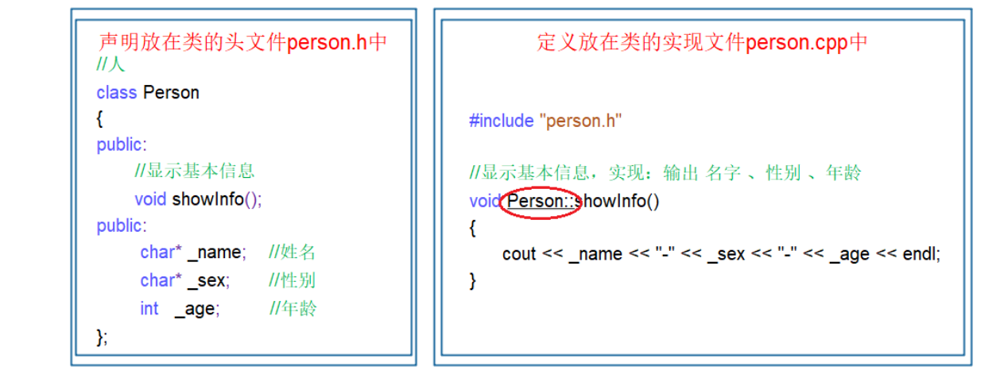

# lesson2_类与对象上

## 1.初步认识

**C语言是面向过程的，关注的是过程，分析出求解问题的步骤，通过函数调用逐步解决问题。**

**C++是基于面向对象的，关注的是对象，将一件事情拆分成不同的对象，靠对象之间的交互完成。**


## 2.类的引入

**C语言中，结构体中只能定义变量，在C++中，结构体内不仅可以定义变量，也可以定义函数。**

```c++
struct Student
{
     void SetStudentInfo(const char* name, const char* gender, int age)
     {
     strcpy(_name, name);
     strcpy(_gender, gender);
     _age = age;
     }

     void PrintStudentInfo()
     {
     cout<<_name<<" "<<_gender<<" "<<_age<<endl;
     }

     char _name[20];
     char _gender[3];
     int _age;
};

int main()
{
     Student s;
     s.SetStudentInfo("Peter", "男", 18);
     return 0;
}
```

**上面结构体的定义，在C++中更喜欢用class来代替**


## 3.类的定义

```c++
class className
{
 // 类体：由成员函数和成员变量组成
 // 成员属性和成员方法的

}; // 一定要注意后面的分号

```



**一般建议声明和定义分开。注意现有头，然后突破类域。**


## 4类的访问限定符及封装

**C++实现封装的方式：用类将对象的属性与方法结合在一块，让对象更加完善，通过访问权限选择性的将其 接口提供给外部的用户使用。**

### 4.1访问限定符

​	**public修饰的成员在类外可以直接被访问**

​	**protected和private修饰的成员在类外不能直接被访问(此处protected和private是类似的)**

​	**访问权限作用域从该访问限定符出现的位置开始直到下一个访问限定符出现时为止**

​	**class的默认访问权限为private，struct为public(因为struct要兼容C)**


**面向对象的三大特性：封装、继承、多态。**

**封装：将数据和操作数据的方法进行有机结合，隐藏对象的属性和实现细节，仅对外公开接口来和对象进行 交互。**


## 5类的作用域

**类定义了一个新的作用域，类的所有成员都在类的作用域中。在类体外定义成员，需要使用 :: 作用域解析符 指明成员属于哪个类域。**

```c++
class Person
{
public:
 void PrintPersonInfo();
private:
 char _name[20];
 char _gender[3];
 int _age;
};
// 这里需要指定PrintPersonInfo是属于Person这个类域
void Person::PrintPersonInfo()
{
 cout<<_name<<" "_gender<<" "<<_age<<endl;
}
```


## 6.类的实例化

**用类类型创建对象的过程，称为类的实例化**


## 7.类对象模型

**成员变量本身大小**

**内存对齐产生的填充字节 padding**

**规则 1：每个成员要放在自己对齐数的整数倍地址上**

| **类型**     | **大小** | **通常对齐数** |
| ------------ | -------- | -------------- |
| **`char`**   | **1**    | **1**          |
| **`short`**  | **2**    | **2**          |
| **`int`**    | **4**    | **4**          |
| **`float`**  | **4**    | **4**          |
| **`double`** | **8**    | **8**          |
| **指针**     | **8**    | **8**          |

```c++
struct S
{
    char a; // 1 字节
    int b;  // 4 字节
};
// | a | padding | padding | padding | b | b | b | b |
```

**规则 2：结构体整体大小必须是最大对齐数的整数倍**

```c++
struct S
{
    int a;   // 4
    char b;  // 1
};

// int a  占 4 字节
// char b 占 1 字节
```

**但是这个结构体里面最大对齐数是 `4`，所以结构体总大小必须是 `4` 的整数倍。**


**总结**

**每个成员的起始地址必须满足自己的对齐要求。**

**整个结构体的大小必须是最大成员对齐数的整数倍。**


## 8.this指针

**C++中通过引入this指针解决该问题，即：C++编译器给每个“非静态的成员函数“增加了一个隐藏的指针参 数，让该指针指**

**向当前对象(函数运行时调用该函数的对象)，在函数体中所有成员变量的操作，都是通过该 指针去访问。只不过所有的操**

**作对用户是透明的，即用户不需要来传递，编译器自动完成。**


**this指针的特性**

**1. this指针的类型：类类型* const**

**2. 只能在“成员函数”的内部使用**

**3. this指针本质上其实是一个成员函数的形参，是对象调用成员函数时，将对象地址作为实参传递给this 形参。所以对象中不存储this指针。**

**4.this指针是成员函数第一个隐含的指针形参，一般情况由编译器通过ecx寄存器自动传递，不需要用户 传递**


