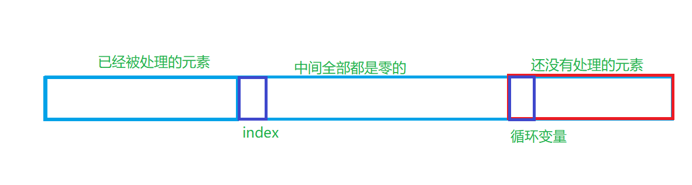
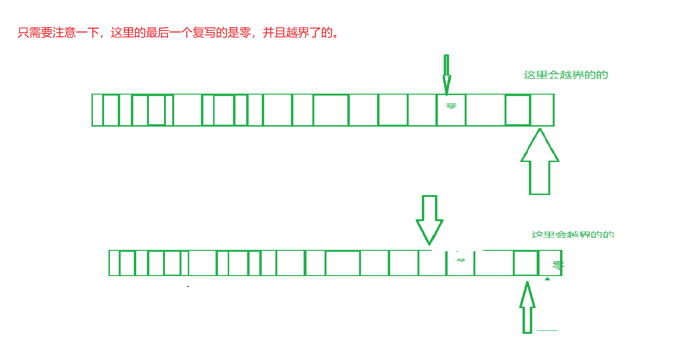
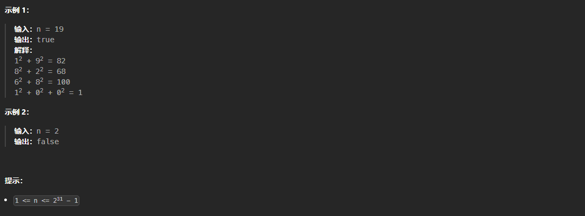
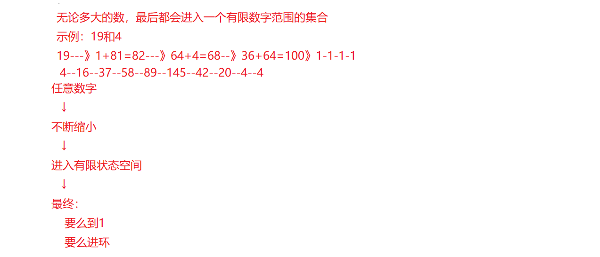
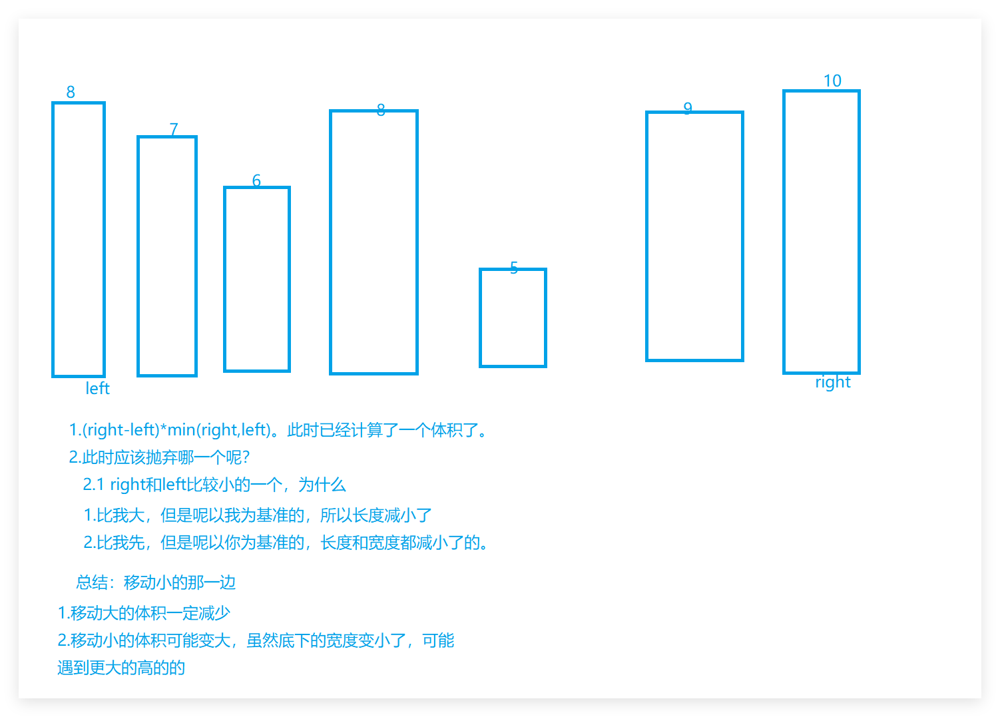
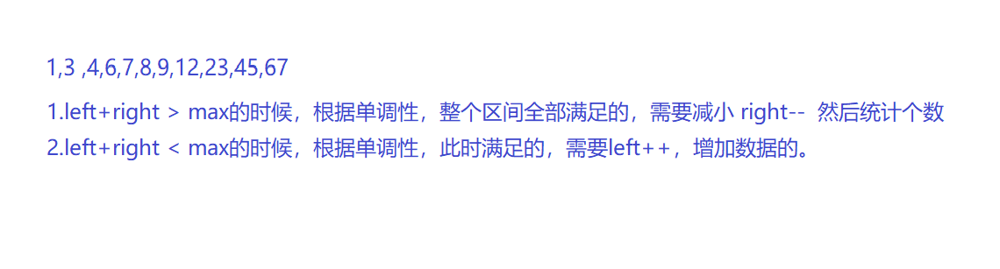
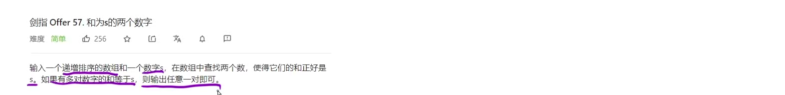

# 算法

# 双指针系列

## 1移动零

**leetcode:283**

**题目描述：**

```
给定一个数组 `nums`，编写一个函数将所有 `0` 移动到数组的末尾，同时保持非零元素的相对顺序。

请注意 ，必须在不复制数组的情况下原地对数组进行操作。
```

**思路：**

**双指针算法：两个指针，把数组分成三部分。**

**块指针：遍历整个数组。**

**慢指针：慢指针左边 已经处理过的区间的。 慢指针右边，全部都是零的。**

**当快指针，结束的时候，就被慢指针完成了的。分成两个区间的。**

**如何实现呢？**

​	**1.快指针遇到零元素的时候：快指针++**

​	**2.快指针遇到非零的时候，交换和慢指针的元素，然后慢指针++**

**扩展：快排里面最核心的一步。**

**c代码**

```c
void moveZeroes(int* nums, int numsSize)
 {
    int slow = 0;
    for(int i = 0; i < numsSize; ++i) // 遇到零元素，不处理的。快指针++
    {
        if(nums[i] != 0)   // 遇到非零元素的，
        {
            int temp = nums[i];
            nums[i] = nums[slow];
            nums[slow] = temp;
            slow++;
        }
    }

    // int index = 0;
    // for(int i = 0; i < numsSize; ++i)
    // {
    //     if(nums[i] != 0)
    //     {
    //         nums[index++] = nums[i];
    //     }
    // }

    // for(int slow = index; slow < numsSize; ++slow)
    // {
    //     nums[slow] = 0;
    // }
    
}
```

**c++代码**

```c++
class Solution 
{
public:
    void moveZeroes(vector<int>& nums) 
    {
        //1.双指针算法(数组里面用数组下标来的)
        //1.一个指针遍历数组，一个指针记录处理的数据
        // size_t index = 0;
        // for(int i = 0; i < nums.size(); i++)
        // {
        //     if(nums[i] != 0)
        //     {
        //         swap(nums[index++], nums[i]);
        //     }
        // }

        // size_t index = 0;
        // for(int i = 0; i < nums.size(); ++i)
        // {
        //     if(nums[i] != 0)
        //     {
        //         nums[index++] = nums[i];
        //     }
        // }

        // for(size_t i = index; i < nums.size(); ++i)
        // {
        //     nums[i] = 0;
        // }

        size_t index = 0;
        for(int i = 0; i < nums.size(); ++i)
        {
            if(nums[i] != 0)
            {
                swap(nums[index++], nums[i]);
            }
        }
    }
};
```

**总结：**

**1.快指针直接遍历整个数组。**

**2.快指针遇到零，快指针直接++**

**3.快指针遇到非零，和慢指针交换元素，慢指针在++**

**4.快指针变量完成，整个任务 也就完成了的。**




## 2复写零

**leetcode 1089**

**题目描述：**

```c
给你一个长度固定的整数数组 arr ，请你将该数组中出现的每个零都复写一遍，并将其余的元素向右平移。

注意：请不要在超过该数组长度的位置写入元素。请对输入的数组 就地 进行上述修改，不要从函数返回任何东西。
```

**思路：**

**暴力解法：**

​	**开辟新的数组进行填充就行了的。**

**双指针算法：**

​	**肯定不能从前面复写，所以只能从后面，这里我们可以计算最后一个复写的数字**

​	**双指针算法，慢指针肯定指向数值末尾，快指针指向最后一个被复习的数。**

**1.最后一个复写的数字。**

​	**1.1 双指针算法找到，最后一个复写的数字。1. 慢指针一个一个遍历，2.快指针遇到非零+1，遇到零+2。**

​	**1.2 最后一复写是  零并且前面找到了数字外面了。**

​			**慢指针：移动到倒数第二，快指针倒数第三**

**2.从后向前开始复写的。**

**c代码：**

```c
void duplicateZeros(int* arr, int arrSize) 
{
// 1.根据数组元素，0加2，非零加+找到需要复写的元素。
    int cur = 0; // 计数器
    int i = 0;   // 复写的位置
    while(cur < arrSize)
    {
        if(arr[i] == 0)
        {
            cur += 2;
        }
        else 
        {
            cur += 1;
        }
        
        // 细节这里是++了，然后才去判断的，
        i++;
    }

    // 这里减1才是正确复写的位置。
    i--;

    int index = arrSize - 1; // 数组下标识从零开始的。
    if(cur > arrSize)
    {
        arr[index--] = 0; // 这种情况，最后一个元素一定是零的。这里减减，下次循环可以直接拿来用，然后在减减。
        i--;              // 跳过最后一个复写的元素
    }

// 全部开始复写了
    while(i >= 0)
    {
        // i慢指针等于0的时候，index移动两次 
        if(arr[i] == 0)
        {
            arr[index--] = 0;
            arr[index--] = 0;
        }
        else 
        {
            arr[index--] = arr[i]; // i慢指针等于非零的时候，index移动两次了
        }
        i--;
    }

    // int cur = 0;  
    // int i = 0;
    
    // while(cur < arrSize)
    // {
    //     if(arr[i] == 0)
    //     {
    //         cur += 2;
    //     }
    //     else 
    //     {
    //         cur += 1;
    //     }
    //     i++;
    // }

    // i--;
    // int index = arrSize-1;

    // if(cur > arrSize)
    // {
    //     arr[index--] = 0;
    //     i--;
    // }

    // while(i >= 0)
    // {
    //     if(arr[i] == 0)
    //     {
    //         arr[index--]=0;
    //         arr[index--]=0;
    //     }
    //     else 
    //     {
    //         arr[index--] = arr[i];
    //     }
    //     i--;
    // }

}
```

**c++代码：**

```c++
class Solution {
public:
    void duplicateZeros(vector<int>& arr) 
    {
        //1.找到最后一个复写的数字，从后面往前面复写
        //2.处理两种情况，复写的长度大于和等于给定的数组
        //3.开始复写
        
        int sz = arr.size();
        int i = 0;       // 记录开始复写的元素
        int cur = 0;      // 记录复写的
        while(cur < sz)
        {
            if(arr[i] == 0)
            {
                cur += 2;
            }
            else 
            {
                cur += 1;
            }
            i++;
        }

        i--; // 里面已经大于了，但是也是i++了一次的。
        int index = sz - 1;
        if(cur > sz)
        {
            arr[index--] = 0;
            i--;
        }

        while(i > 0)
        {
            if(arr[i] == 0)
            {
                arr[index--] = 0;
                arr[index--] = 0;
            }
            else 
            {
                arr[index--] = arr[i];
            }
            i--;
        }

        // int sz = arr.size();
        // int cur = 0;
        // int i = 0;
        // while(cur < sz)
        // {
        //     if(arr[i]  == 0)
        //     {
        //         cur += 2;
        //     }
        //     else 
        //     {
        //         cur += 1;
        //     }
        //     i++;
        // }

        // i--;
        // int index = sz-1;
        
        // if(cur > sz)
        // {
        //     arr[index--] = 0;
        //     i--;
        // }

        // while(i > 0)
        // {
        //     if(arr[i] == 0)
        //     {
        //         arr[index--] = 0;
        //         arr[index--] = 0;
        //     }
        //     else 
        //     {
        //         arr[index--] = arr[i];
        //     }
        //     i--;
        // }

        // int n = arr.size();
        // int cur = 0;  // 判断满了没得
        // int i = 0;   // 需要复写的最后一个元素。

        // // 1. 找到最后一个会被处理的元素
        // while (cur < n) 
        // {
        //     if (arr[i] == 0) cur += 2;
        //     else cur += 1;
        //     i++;
        // }

        // i--;                // 最后一个有效原数组元素
        // int index = n - 1;  // 实际写入位置

        // // 2. 处理“多出来的 0”
        // if (cur > n) 
        // {      // 说明最后是 0，只能写一个
        //     arr[index] = 0;
        //     index--;
        //     i--;
        // }

        // // 3. 从后往前写
        // while (i >= 0) 
        // {
        //     if (arr[i] == 0) 
        //     {
        //         arr[index--] = 0;
        //         arr[index--] = 0;
        //     } 
        //     else 
        //     {
        //         arr[index--] = arr[i];
        //     }
        //     i--;
        // }

    }
};

```

**总结：**

**1.需要两次双指针算法**

**2.第一次双指针找到需要复写的最后一个元素。**

**3.复写之前判断，是不是越界了的，越界了最后一个就是零，需要最后一个位置填写零，复写位置前移动。**




## 3快乐数

**leetcode202**

**题目描述：**

```
编写一个算法来判断一个数 n 是不是快乐数。

「快乐数」 定义为：

对于一个正整数，每一次将该数替换为它每个位置上的数字的平方和。
然后重复这个过程直到这个数变为 1，也可能是 无限循环 但始终变不到 1。
如果这个过程 结果为 1，那么这个数就是快乐数。
如果 n 是 快乐数 就返回 true ；不是，则返回 false 。
示例 1：
```



**思路：**

**判断链表是否有环状。快乐数环是1的，不是快乐数是非一的。**

**1.快慢指针。（不一定是指针，可能是数组下标。）**

**2.快指针移动两步，慢指针移动一步。**

**3.判断相遇时候的值即可。**

**为什么一定会相遇呢：？**

​	**格巢原理（抽屉原理）**

​	**n个位置，n+1个格子，至少一个位置大于一的。**

​	**‭2 147 483 647‬  [1, 810)**

​	**9 999 999 999 ----f--- [1,810]**

​	

**代码**

**c代码：**

```c

// int bitSum(int n)
// {
//     int sum = 0;
//     while(n > 0)
//     {
//         int t = n % 10;
//         sum += t * t;
//         n /= 10;
//     }
//     return sum;
// }

// 计算每一位的的和
int bitSum(int n)
{
    int sum = 0;
    while(n)
    {
        int t = n % 10;
        sum +=  t*t;
        n /= 10;
    }

    return sum;
}

bool isHappy(int n)
{
    //抽屉原理
    // int slow = n;
    // int fast = bitSum(n);
    // while(slow != fast)
    // {
    //     slow = bitSum(slow);
    //     fast = bitSum(bitSum(fast));
    // }

    int slow = n;
    int fast = bitSum(n); // 快指针先走一步
    while(slow != fast)
    {
        slow = bitSum(slow); // 慢指针一步一步走
        fast = bitSum(bitSum(fast)); // 快指针两步两步走
    }

    return fast == 1;
}
```

**c++代码**

```c++
class Solution {
public:
//     bool isHappy(int n) 
//     {   
        
//         int slow = n;
//         int fast = bitSum(n);
//         while(slow != fast)
//         {
//             slow = bitSum(slow);
//             fast = bitSum(bitSum(fast));
//         }

//         return fast == 1;
//     }


// private:
//     int bitSum(int n)
//     {
//         int sum = 0;
//         while(n > 0)
//         {
//             int t = n % 10; // 取0-9;
//             sum += t * t;
//             n /= 10;        // 删除一位 
//         }
//         return sum;
//     }

bool isHappy(int n)
{
    int slow = n;
    int fast = bitSum(n);
    while(slow != fast)
    {
        slow = bitSum(slow);
        fast = bitSum(bitSum(fast));
    }
    return fast == 1;
}

private:
    int bitSum(int n)
    {
        int sum = 0;
        while(n)
        {
            int t = n % 10;
            sum += t * t;
            n /= 10;
        }
        return sum;
    }
};
```

**总结就是一个人一个坑：判断多的坑会不会进入到1的**




## 4盛水最多的容器

**leetcode 11**

**题目描述**

```
给定一个长度为 n 的整数数组 height 。有 n 条垂线，第 i 条线的两个端点是 (i, 0) 和 (i, height[i]) 。

找出其中的两条线，使得它们与 x 轴共同构成的容器可以容纳最多的水。

返回容器可以储存的最大水量。

说明：你不能倾斜容器。
```


```
输入：[1,8,6,2,5,4,8,3,7]
输出：49 
解释：图中垂直线代表输入数组 [1,8,6,2,5,4,8,3,7]。在此情况下，容器能够容纳水（表示为蓝色部分）的最大值为 49。
```

**示例 2：**

```
输入：height = [1,1]
输出：1
```

**思路**

**暴力解法，暴力遍历。**

**先固定左边一个，两个，，，n-1个。**

**1.应该是双指针算法的。**

**2left指针，right指针。**

```
**6 2 5 4**
left = 6
right = 4;
v1 = 3*2 = 6

right开始向内枚举了
// 4遇到比我大的数，但是以为我为标准的，高不变，宽度一定减少的
// 4遇到比我小的树，宽度一定减小了，高度更小了的。

相等随便都行的。
```


**代码示例**

**c代码**

```c
int maxArea(int* height, int heightSize) 
{
    // int left = 0;
    // int right = heightSize - 1;
    // int ret = 0;
    // while(left < right)
    // {
    //     int v = (height[left] < height[right] ? height[left] : height[right]) * (right - left); 
    //     ret = ret > v ? ret : v;

    //     if(height[left] < height[right]) left++;
    //     else right--; 
    // }

    int left = 0;
    int right = heightSize -1;
    int max = 0;

    // 他们两个不想相等，之间就存在体积的。
    while(left < right)
    {
        // 1.计算体积
        int v =(height[left] < height[right] ? height[left] : height[right]) * (right - left);

        // 2.更新体积
        max = max > v ? max : v;

        // 3.注意算一次，就扔掉一个小的
        if(height[left] < height[right])
        {
            left++;
        }
        else 
        {
            right--;
        }
    }

    return max;
}
```

**c++代码**

```c++
class Solution {
public:
    int maxArea(vector<int>& height) 
    {
        // 暴力枚举
        // 双层for循环
        // 暴力枚举2

        //1.研究小区间
        //6 2 5 4
        //

        int letf = 0;
        int right = height.size()-1;
        int ret = 0;
        while(letf < right)
        {
            int v = min(height[letf], height[right])*(right - letf);
            ret = max(ret, v);

            if(height[letf] < height[right]) letf++;
            else right--;
        }

        return ret;
    }
};
```

**总结：**

**解题关键。**

**1.从两段开始枚举**

**2.最关键为什么。算一个就扔掉一个小的。为什么。为什么？**

**2.最关键为什么。算一个就扔掉一个小的。为什么。为什么？**




## 5有效三角形个数

**leetcode611**

**题目描述：**

**给定一个包含非负整数的数组 `nums` ，返回其中可以组成三角形三条边的三元组个数。**

**示例 1:**

```
输入: nums = [2,2,3,4]
输出: 3
解释:有效的组合是: 
2,3,4 (使用第一个 2)
2,3,4 (使用第二个 2)
2,2,3
```

**示例 2:**

```
输入: nums = [4,2,3,4]
输出: 4
```

**思路**

**三个数是否能够构成三角形。任意两边只大于第三边。  有顺序的时候，两个小的大于第三边。**

```
a<=b<=c
a+b > c
a+c > b
b+c > a
```

**暴力解法**

**1.一层循环固定第一个数**

**2.二层循环固定第二个数**

**3.三层循环固定第三个数**

​	**无须，进行三次判断的。**

**1.先对数组进行排序的。**

**2.利用单调性，使用双指针算法。**

```
2,2,3,4,5,9,10
1.固定10
2.left=2, right=9 2+9>10
  所以right--
3.left=2, right=5 2+5<10
  所以left++
```

**1.情况当left+right > max的时候，根据单调性，区间全部大于的。此时 应该减小数字，right--**

**2.情况当left+right  < max的时候，根据单调性，区间全部小于的，此时，应该增大数字，left++**

**max--**

**1.固定最大的数据**

**2.最大数的左区间，使用双指针算法，判断三元组的个数。  判断逻辑 上面。**


**示例：**

**c代码**

```c
int cmp(const void*a, const void*b)
{
    return *(int*)a - *(int*)b;
}

int triangleNumber(int* nums, int numsSize) 
{

//1.排序
//2.a<b<c 只有a + b > c就行
//3.利用升序，减少计算就行了。
    qsort(nums, numsSize, sizeof(int), cmp);
    int ret = 0;
    for(int i = numsSize - 1; i >= 2; i--)
    {
        int left = 0;
        int right = i - 1;
        while(left < right)
        {
            if(nums[left] + nums[right] > nums[i])
            {
                ret += right - left;
                right--;
            }
            else
            {
                left++;
            }
        }
    }
    return ret;

    // for(int i = 0; i < numsSize - 1; i++)
    // {
        
    //     for(int j = 0; j < numsSize - 1 - i; j++)
    //     {
    //         if(nums[j] > nums[j + 1])
    //         {
    //             int temp = nums[j];
    //             nums[j] = nums[j+1];
    //             nums[j+1] = temp;
    //         }
    //     }
    // }


    // int ret = 0;
    // for(int i = numsSize - 1; i >=2; i--)
    // {
    //     int left = 0;
    //     int right = i-1;
        
    //     while(left < right)
    //     {
    //         if(nums[left] + nums[right] > nums[i])
    //         {
    //             ret += right-left;
    //             right--;
    //         }
    //         else 
    //         {
    //             left++;
    //         }
    //     }
    // }

    return ret;
}
```


**c++代码**

```c++
class Solution {
public:
    int triangleNumber(vector<int>& nums) 
    {
        // 1.先进行排序的。
        sort(nums.begin(), nums.end());
        
        int ret = 0;
        int n = nums.size();

        // 2.需要遍历整个数组的
        for(int i = n - 1; i >=2; i--) // 
        {
            // 3.left指针和right指针。
            int left = 0;
            int right = i - 1;

            // 4.left<right之间就存在数字
            while(left < right)
            {
                //5.1,5.2的判断都是根据单调性的
                // 5.1当区间的数，已经大于了max,此时应该减少数组，所以right--
                if(nums[left] + nums[right] > nums[i])
                {
                    ret += right - left;
                    right--;
                }
                // 5.2当区间的数，已经小雨了max,此时应该增大数组，所以left++
                else 
                {
                    left++;
                }
            }
        }
        //6返回结果即可
        return ret;


        // 任意 a + b > c;
        // 这里可以计算重复的
        // a<=b<=c -- 这里只需要判断 a+b>c。c无论加上a,b都是大的。
        // 优化先对数据进行排序
        /*
            for(i = 0; i < n; i++)
                for(j = 0; j < n; j++)
                    for(k = 0; k < n; k++)
                        check(i, j k)     3 * n3  nlogn + n3
            0   1  2  3  4  5   6
            [2, 2, 3, 4, 5, 9, 10]
             2+9 > 10 已经大于10现在只需要 right--; right-left种方法
             2+5 < 10 已经小于10现在只需要 left++;
             letf==right时 10--。
        
        1.固定最大的数
        2.最大数左边区间，双指针计算
        3.
        */

        // sort(nums.begin(), nums.end());
        
        // int ret = 0; 
        // int n = nums.size();
        // for(int i = n - 1; i >= 2; i--)
        // {
        //     // 双指针统计
        //     int left = 0;
        //     int right = i - 1;
        //     while(left < right)
        //     {
        //         if(nums[right] + nums[left] > nums[i])
        //         {
        //             ret += right - left;
        //             right--;
        //         }
        //         else 
        //         {
        //             left++;
        //         }
        //     }
        // }

        // return ret;

    }
};
```

**总结：**

**1.先固定最大的值，从后面往前面进行遍历的。**

**2.然后双指针的left是0，right是max-1的数组下标。**

​	**枚举**

**根据单调性进行判断，所以排序算法还是很重要的。**




## 6和为s的两个数字

**leetcode: [LCR 179. 查找总价格为目标值的两个商品](https://leetcode.cn/problems/he-wei-sde-liang-ge-shu-zi-lcof/)**



**题目描述**

购物车内的商品价格按照升序记录于数组 `price`。请在购物车中找到两个商品的价格总和刚好是 `target`。若存在多种情况，返回任一结果即可。

**示例 1：**

```
输入：price = [3, 9, 12, 15], target = 18
输出：[3,15] 或者 [15,3]
```

**示例 2：**

```
输入：price = [8, 21, 27, 34, 52, 66], target = 61
输出：[27,34] 或者 [34,27]
```

**思路：**

**暴力算法：两层遍历。1.外层循环一个一个固定到n-1, 内存循环的 **


**1.有序很重要的。**

**2.双指针算法**


**代码示例：**

**c代码**

```c
/**
 * Note: The returned array must be malloced, assume caller calls free().
 */
int* twoSum(int* price, int priceSize, int target, int* returnSize) 
{
    // 升序很关键的
    *returnSize = 2;
    int* ret = (int*)malloc(sizeof(int)*2);

    int left = 0;
    int right = priceSize - 1;
    while(left < right)
    {
        if(price[left] + price[right] > target)
        {
            right--;
        }
        else if(price[left] + price[right] < target)
        {
            left++;
        }
        else 
        {
            ret[0] = price[left];
            ret[1] = price[right];
            break;
        }
    }
    return ret;
}
```

**c++代码**

```c++
class Solution 
{
public:
    vector<int> twoSum(vector<int>& price, int target) 
    {
    // 1.找到左右指针
        int sz = price.size();
        int left = 0;
        int right = sz - 1;
        vector<int> v;
    // 2.左指针<右指针 中间一定有数据的
        while(left < right)
        {   
            // 根据单调性，大了，需要减小，right--
            if(price[left] + price[right] > target)
            {
                right--;
            }
            // 根据单调性，小了，需要增大，left++
            else if(price[left]  + price[right] < target)
            {
                left++;
            }
            // 找到了，
            else 
            {
                v.push_back(price[left]);
                v.push_back(price[right]);
                // 注意，注意，否则死循环的。需要break;
                break;
            }
        }

        return v;

        // int sz = price.size();
        // int left = 0;
        // int right = sz - 1;
        // vector<int> v;
        // while(left != right)
        // {
        //     if(price[left] + price[right] > target)
        //     {
        //         right--;  // 右边到左边递减
        //     }
        //     else if(price[left] + price[right] < target)
        //     {
        //         left++; //  左边到右边递增
        //     }
        //     else 
        //     {
        //         v.push_back(price[left]);
        //         v.push_back(price[right]);
        //         break;
        //     }
        // }
        // return v;

        // vector<int> v;
        // int sz = price.size();  
        // for(int i  = 0; i < sz - 1; i++)
        // {
        //     for(int j = i + 1; j < sz; j++)
        //     {
        //         if(price[i] + price[j] == target)
        //         {
        //             v.push_back(price[i]);
        //             v.push_back(price[j]);
        //             break;
        //         }
        //     }
        // }
        // return v;
    }
};
```


## 7三数之和

**leetcode 15**

**题目描述**

给你一个整数数组 `nums` ，判断是否存在三元组 `[nums[i], nums[j], nums[k]]` 满足 `i != j`、`i != k` 且 `j != k` ，同时还满足 `nums[i] + nums[j] + nums[k] == 0` 。请你返回所有和为 `0` 且不重复的三元组。

**注意：**答案中不可以包含重复的三元组。

**示例 1：**

```
输入：nums = [-1,0,1,2,-1,-4]
输出：[[-1,-1,2],[-1,0,1]]
解释：
nums[0] + nums[1] + nums[2] = (-1) + 0 + 1 = 0 。
nums[1] + nums[2] + nums[4] = 0 + 1 + (-1) = 0 。
nums[0] + nums[3] + nums[4] = (-1) + 2 + (-1) = 0 。
不同的三元组是 [-1,0,1] 和 [-1,-1,2] 。
注意，输出的顺序和三元组的顺序并不重要。
```

**示例 2：**

```
输入：nums = [0,1,1]
输出：[]
解释：唯一可能的三元组和不为 0 。
```

**示例 3：**

```
输入：nums = [0,0,0]
输出：[[0,0,0]]
解释：唯一可能的三元组和为 0 。
```


**思路：**

**暴力解法：枚举，然后排序去重。**

**排序：想到双指针和二分算法。双指针算法优先，有可能二分优先。**

**1.不重复的意思，顺序不一样的，但是元素一样的，只是保留一种情况的。**

**2.顺序返回随意的。**

**3.排序，然后固定最大值，然后双指针判断。**

**4.难点：去重操作。**

**5.set帮我们去重。c++算法还需要补充。**

**7.排序 + 固定一个数 + 双指针找到两个数的和。 关键是去重的。**

**8.不漏。 找到一种情况之后，继续缩小双指针区间，继续寻找。 找到一种情况的时候，需要跳过重复的元素。**

**1.去重。固定的数，需要去重。双指针的也需要去重的。 消息越界。**

**代码示例：**

**c++代码**

```c++
class Solution 
{
public:
    vector<vector<int>> threeSum(vector<int>& nums) 
    {
        vector<vector<int>> ret;
        int n = nums.size();

        //1.排序
        sort(nums.begin(), nums.end());

        // 特殊情况，没有三个数直接返回的。
        if(nums.size() < 3)
        {
            return ret;
        }

        // 2.固定第一个数
        for(int i = 0; i < n - 2; ++i)
        {   
            // 最小的数大于零，直接退出
            if(nums[i] > 0)
            {
                break;
            } 

            // 3.去重固定的第一个数
            if(i > 0 && nums[i] == nums[i - 1])
            {
                continue;
            }

            // 1.双指针的left和right;
            int left = i + 1;
            int right = n - 1;

            while(left < right)
            {
                int sum = nums[i] + nums[left] + nums[right];
                if(sum > 0)
                {
                    right--;
                }
                else if(sum < 0)
                {
                    left++;
                }
                else 
                {
                    ret.push_back({nums[i], nums[left], nums[right]});
                    // 1. 已经满足了，所以双指针都需要移动的
                    left++;
                    right--;

                    // 2.开始去重了
                    while(left < right && nums[left] == nums[left-1])
                    {
                        left++;
                    }
                    while(left < right && nums[right] == nums[right + 1])
                    {
                        right--;
                    }

                    // 3.完成去重的时候。 nums[left]和nums[right]都不相等了的

                }
            }

        }

        return ret;
    }

        // vector<vector<int>> ret;
        // // 1.排序
        // sort(nums.begin(), nums.end());

        // // 2.双指针算法
        // int n = nums.size();
        // for(int i = 0; i < n; ) // 固定第一个数
        // {
        //     if(nums[i] > 0) break; // 最小的i都大于零，直接退出就行了的

        //     int target = -nums[i];
        //     int left = i + 1;
        //     int right = n - 1;

        //     while(left < right)
        //     {
        //         int sum = nums[left] + nums[right];
        //         if(sum > target)
        //         {
        //             right--;
        //         }
        //         else if(sum < target)
        //         {
        //             left++;
        //         }
        //         else 
        //         {
        //              ret.push_back({nums[i], nums[left], nums[right]});
        //             left++;
        //             right--;

        //             // 去重的left和right;
        //             while(left < right && nums[left] == nums[left-1])
        //             {
        //                 left++;
        //             }
        //             while(left < right && nums[right] == nums[right+1])
        //             {
        //                 right--;
        //             }
        //         }


        //     }
        //         // 去重right;
        //         i++;
        //         while(i < n && nums[i] == nums[i-1])
        //         {
        //             i++;
        //         }

          
        // }
        // return ret;


        // vector<vector<int>> ret;
        // int n = nums.size();
        // sort(nums.begin(), nums.end());
        // if (n < 3) return ret ;

        // for(int i = 0; i < n - 2; i++)
        // {
        //     if(nums[i] > 0) break; // 已经是排序的了，最小的都大于零，其它的也大于零了。
        //     int left = i + 1;
        //     int right = n - 1;

        //     if(i > 0 && nums[i] == nums[i-1]) continue; // 第一次不用重复，后面得才开始去重。num[i] num[i-1]判断已经走过的数字

        //     while(left < right)
        //     {
        //         int sum = nums[i] + nums[left] + nums[right];
        //         if(sum > 0)
        //         {
        //             right--;
        //         }
        //         else if(sum < 0)
        //         {
        //             left++;
        //         }
        //         else 
        //         {
        //             ret.push_back({nums[i], nums[left], nums[right]});
        //             while(left < right && nums[left] == nums[left + 1]) left++;
        //             while(left < right && nums[right] == nums[right - 1]) right--;
        //             left++;
        //             right--;
        //         }
        //     }
        // }
        // return ret;
        //1.暴力解法，暴力枚举。
        //2. 如何去重？

        // 1.先排序，枚举，set去重

        // 1.排序，双指针或者二分法，
        // 找到一种结果之后，跳过重复的元素。 left right 和i
        // 需要两个地方去重 
        // vector<vector<int>> ret;
        // int n = nums.size();
        
        // sort(nums.begin(), nums.end());
        // for(int i = 0; i < n; )
        // {
        //     if(nums[i] > 0) break;
        //     int left = i + 1;
        //     int right = n - 1;
        //     int target = -nums[i];

        //     while(left < right)
        //     {
        //         int sum = nums[left] + nums[right];
        //         if(sum > target)
        //         { 
        //             right--;
        //         }
        //         else if(sum < target) 
        //         {
        //             left++;
        //         }
        //         else 
        //         {
        //             ret.push_back({nums[i], nums[left], nums[right]});
        //             left++;
        //             right--;

        //             while(left < right && nums[left] == nums[left-1]) 
        //             {
        //                 left++;
        //             }
        //             while(left < right && nums[right] == nums[right+1]) 
        //             {
        //                 right--;
        //             }
        //         }
        //     }

        //     i++;
        //     while(i < n && nums[i] == nums[i-1]) i++;
        // }
        // return ret;

    //     vector<vector<int>> ret;
    //     int n = nums.size();
    //     sort(nums.begin(), nums.end());

    //     for(int i = 0; i < n - 2; i++)
    //     {
    //         if(nums[i] > 0) break;

    //         if(i > 0 && nums[i] == nums[i-1]) continue; // 第一次外面的去重了

    //         int left = i + 1;
    //         int right = n - 1;
    //         while(left < right)
    //         {
    //             int sum = nums[i] + nums[left] + nums[right];
    //             if(sum ==  0)
    //             {
    //                 ret.push_back({nums[i], nums[left], nums[right]});
    //                 while (left < right && nums[left] == nums[left + 1]) left++;
    //                 while (left < right && nums[right] == nums[right - 1]) right--;
                    
    //                 left++;
    //                 right--;
    //             }
    //             else if(sum <  0) 
    //             {
    //                 left++;
    //             }
    //             else 
    //             {
    //                 right--;
    //             }
    //         }
    //     }
    //     return ret;
    // }
};
```


**c代码**

```c
/**
 * Return an array of arrays of size *returnSize.
 * The sizes of the arrays are returned as *returnColumnSizes array.
 * Note: Both returned array and *columnSizes array must be malloced, assume caller calls free().
 */
int** threeSum(int* nums, int numsSize, int* returnSize, int** returnColumnSizes) 
{
    // for(int i = 0; i < numsSize - 1; i++)
    // {
    //     for(int j = 0; i < numsSize - 1 - i; j++)
    //     {
    //         if(nums[j] > nums[j + 1])
    //         {
    //             int temp = nums[j];
    //             nums[j] = nums[j +1];
    //             nums[j + 1] = temp;
    //         }
    //     }
    // }

    *returnSize = 0;
    if(numsSize < 3)
    {
        return NULL;
    }

    int cmp(const void* a, const void* b)
    {
        return *(int*)a - *(int*)b;
    }
    qsort(nums, numsSize, sizeof(int),  cmp);

    int capacity = numsSize*numsSize;
    int** result = (int**)malloc(sizeof(int*) * capacity);         // 定义一个 capacity*capacity的数组，里面存放指针。
    *returnColumnSizes = (int*)malloc(sizeof(int*) * capacity);    // 

    for(int i = 0; i < numsSize - 2; i++)
    {
        if(nums[i] > 0) break;
        if(i > 0 && nums[i] == nums[i-1]) continue;

        int letf = i + 1;
        int right = numsSize - 1;
        while(letf < right)
        {
            int sum = nums[i] + nums[letf] + nums[right]; // 注意溢出
            if(sum == 0)
            {
                result[*returnSize] = (int*)malloc(sizeof(int)*3);
                result[*returnSize][0] = nums[i];
                result[*returnSize][1] = nums[letf];
                result[*returnSize][2] = nums[right];

                // 记录这一行的列数 (固定是3)
                (*returnColumnSizes)[*returnSize] = 3;
                
                // 结果总数 +1
                (*returnSize)++;

                while(letf < right && nums[letf]  ==  nums[letf   + 1]) letf++;
                while(letf < right && nums[right] ==  nums[right] - 1) right--;
                letf++;
                right--;
            }
            else if(sum < 0) 
            {
                letf++;
            }
            else 
            {
                right--;
            }
        }
    }

    return result;
}
```

**总结：**

**1.第一个数，第一次不需要去重的，**

```c++
            // 3.去重固定的第一个数
            if(i > 0 && nums[i] == nums[i - 1])
            {
                continue;
            }
```

**2.第二个数和第三个数去重。**

```c++
                    // 2.开始去重了
                    while(left < right && nums[left] == nums[left-1])
                    {
                        left++;
                    }
                    while(left < right && nums[right] == nums[right + 1])
                    {
                        right--;
                    }
```


## 8四数之和

**leetcode 18**

**题目描述**

给你一个由 `n` 个整数组成的数组 `nums` ，和一个目标值 `target` 。请你找出并返回满足下述全部条件且**不重复**的四元组 `[nums[a], nums[b], nums[c], nums[d]]` （若两个四元组元素一一对应，则认为两个四元组重复）：

- `0 <= a, b, c, d < n`
- `a`、`b`、`c` 和 `d` **互不相同**
- `nums[a] + nums[b] + nums[c] + nums[d] == target`

你可以按 **任意顺序** 返回答案 。

**示例 1：**

```
输入：nums = [1,0,-1,0,-2,2], target = 0
输出：[[-2,-1,1,2],[-2,0,0,2],[-1,0,0,1]]
```

**示例 2：**

```
输入：nums = [2,2,2,2,2], target = 8
输出：[[2,2,2,2]]
```

**思路：**

**1.排序**

**2.第一层循 固定第一个数**

**3.第二次循环 固定第二个数**

**4.内存循环双指针。**

**代码示例：**

**c++代码**

```c++
class Solution {
public:
    vector<vector<int>> fourSum(vector<int>& nums, int target) 
    {
        vector<vector<int>> ret;
        sort(nums.begin(), nums.end());

        int n = nums.size();
        if (n < 4) return ret;

        for(int i = 0; i < n - 3; ++i)
        {
            // 1.跳过第一个数
            if(i > 0 && nums[i] == nums[i-1])
            {
                continue;
            }

            for(int j = i + 1; j < n - 2; ++j)
            {   
                // 2.跳过第二个数。
                if(j > i + 1 && nums[j] == nums[j-1])
                {
                    continue;
                }

                int left = j + 1;
                int right = n - 1;
                while(left < right)
                {
                    long long sum = (long long)nums[i] + nums[j] + nums[left] + nums[right];
                    if(sum == target)
                    {
                        ret.push_back({nums[i], nums[j], nums[left], nums[right]});
                        left++;
                        right--;

                        while(left < right && nums[left] == nums[left-1]) left++;
                        while(left < right && nums[right] == nums[right+1]) right--;
           
                    }
                    else if( sum > target)
                    {
                        right--;
                    }
                    else 
                    {
                        left++;
                    }
                }
            }
        }

        return ret;

        // vector<vector<int>> ret;
        // sort(nums.begin(), nums.end());

        // //1. a.固定一个数a, target;
        // //2. a []三数之和等于 target-a;
        // //3. a b[] 双指针等于 target - a - b;

        // // 不重复，不漏
        // // a b [left ...  right]

        // int n = nums.size();
        // if (n < 4) return ret;

        // for(int i = 0; i < n - 3; i++) // 固定数a
        // {
        //     if(i > 0 && nums[i] == nums[i - 1]) continue;

        //     for(int j = i + 1; j < n - 2; j++) // 固定数b;
        //     {
        //         if(j > i + 1 && nums[j] == nums[j - 1])  continue;

        //         int left = j + 1;
        //         int right = n - 1;

        //         while(left < right)
        //         {
        //             long long sum = (long long)nums[i] + nums[j] + nums[left] + nums[right];
        //             if(sum == target)
        //             {
        //                 ret.push_back({nums[i], nums[j], nums[left], nums[right]});

        //                 while(left < right && nums[left] == nums[left+1]) left++;
        //                 while(left < right && nums[right] == nums[right-1]) right--;
        //                 left++;
        //                 right--;
        //             }
        //             else if(sum > target)
        //             {
        //                 right--;
        //             }
        //             else 
        //             {
        //                 left++;
        //             }
        //         }
        //     }
        // }
        // return ret;
    }
};
```


**c代码**

# 滑动窗口系列

## 9长度最小的子串

**leetcode:209**

给定一个含有 `n` 个正整数的数组和一个正整数 `target` **。**

找出该数组中满足其总和大于等于 `target` 的长度最小的 **子数组** `[numsl, numsl+1, ..., numsr-1, numsr]` ，并返回其长度**。**如果不存在符合条件的子数组，返回 `0` 。

**示例 1：**

```
输入：target = 7, nums = [2,3,1,2,4,3]
输出：2
解释：子数组 [4,3] 是该条件下的长度最小的子数组。
```

**示例 2：**

```
输入：target = 4, nums = [1,4,4]
输出：1
```

**示例 3：**

```
输入：target = 11, nums = [1,1,1,1,1,1,1,1]
输出：0
```

**注意正整数。需要是连续的区间。**

**滑动窗口解决。**

**思路：**

**暴力算法：枚举子数组。**

**滑动窗口：**

**1.都是正数，加的越多，数组越大。**

**2.left和right指向其实位置。**

**3.和小于的时候 right++。**

**4.和大于的时候 left++。**

**同向双指针--滑动窗口。**

**1. 小于sum的时候，right++，进窗口。**

**2.大于sum的时候，left++,    出窗口。**

```
1.left左窗口，right右窗口
2.进窗口
3.判断
	出窗口。
进一次窗口，就判断一次的。
更新结果，就题论题的。
```

**为什么？1.单调性解释。规避了很多没有必要的枚举。**

**时间复杂度：O(N)级别的**


**代码示例：**

**c++代码**

```c++
class Solution {
public:
    int minSubArrayLen(int target, vector<int>& nums) 
    {
        // 1.定义窗口的指针。
        int left = 0;
        int right = 0;
        int ret = INT_MAX; // 定义很大的值，是为了更新窗口信息的。
        int sum = 0;

        // 2.right到了头，数据遍历完毕了的。
        while(right < nums.size())
        {
            sum += nums[right];
            
            // 3.进窗口，就要判断一次的。
            while(sum >= target)
            {
                // 4.更新结果的
                ret = min(ret, right - left + 1); 

                // 5.出窗口，滑动一次的。
                sum -= nums[left++];
            }

            right++;
        }

        return ret == INT_MAX ? 0 : ret;

        /*
            1.暴力枚举
            2.
                2.[2,3,1,2,4,3]
                        right    
                3. 2 3 1 2 >=7 了
                 letf
                           right
                4. 2 3 1 2 4
                    letf    321<7
                4.
            利用单调性，使用同向双指针算法。
            同向双指针，滑动窗口呢。
            就是利用这个窗口，判断。

        */

        // int left = 0;
        // int right = 0;
        // int n = nums.size();
        // int ret = INT_MAX;
        // int sum = 0;
        // while(right < n)
        // {
        //     sum += nums[right];
        //     while(sum >= target)
        //     {   ret = min(ret, right - left + 1);
        //         sum -= nums[left++];
        //     }
        //     right++;
        // }
        // return ret == INT_MAX ? 0 : ret;

        // 最短的子数组，并且是连续的数组。
        // 滑动窗口
        // 1.暴力算法
           // [2,3,1,2,4,3]
           // target = 7
           // 暴力枚举全部的数

           //[2 3 1 4]
           // l     r >= target;
           //   l   r
        // 利用单调性，同向双指针,滑动窗口。
        // 怎么用呢？

        // 1.left = 0; right = 0;
        // 2.进入窗口
        // 3.判断 
        //   出窗口
        /*
            r
            2 3 1 2 4 3
            l

            1.l = 0; r  = 0; sum = 0;
            2.进入窗口 sum = 2
            3.进 sum = 5;
            4.进 sum = 6;
            5.进 sum = 8;
                出，更新sum(这里是这道题更新结果。)
                len = r-l
                sum = 6;
                l++(3)
            6.进  sum = 10;
                len = r - l;
                sum = 7;
                l++;(1)
                
                二次判断
                len = r - l;
                sum = 6;
                l++;l=(2)

            7.进
        */

        /*
            为什么是对的？
            单调性：
                  r
            2 3 1 2  4 3
            l

            l+r>=target，已经没有必要枚举后面的了的。
            
        */

        // 时间复杂度2N；N
        // int n = nums.size();
        // int sum = 0;
        // int ret = INT_MAX;
        // for(int left = 0, right = 0; right < n; right++)
        // {
        //     sum += nums[right]; // 进入窗口
        //     while(sum >= target) // 判断
        //     {
        //         ret = min(ret, right-left+1); // 跟新结果
        //         sum -= nums[left++];   // 滚出窗口
        //     }
        // }
        // return ret  == INT_MAX ? 0 : ret;

    }


/*
#include <vector>
#include <algorithm>
#include <climits> // 用于 INT_MAX

using namespace std;

class Solution {
public:
    int minSubArrayLen(int target, vector<int>& nums) {
        int n = nums.size();
        if (n == 0) return 0;

        int left = 0;
        int right = 0;
        int sum = 0;
        int minLen = INT_MAX; // 初始化为最大整数，方便后面取最小值

        // 移动 right 指针扩大窗口
        while (right < n) {
            sum += nums[right];

            // 当窗口内的和满足条件时，尝试缩小窗口
            while (sum >= target) {
                // 更新最小长度
                int currentLen = right - left + 1;
                minLen = min(minLen, currentLen);

                // 缩小窗口：减去左边的值，左指针右移
                sum -= nums[left];
                left++;
            }
            
            // 继续扩大窗口
            right++;
        }

        // 如果 minLen 还是 INT_MAX，说明没找到满足条件的子数组，返回 0
        return (minLen == INT_MAX) ? 0 : minLen;
    }
};
*/

};
```


**c代码**

```c
int minSubArrayLen(int target, int* nums, int numsSize) 
{
    // 1.定义左右窗口和保存的结果
    int left = 0;
    int right = 0;
    int ret = INT_MAX;
    int sum = 0;
    while(right < numsSize)
    {
        sum += nums[right];
        while(sum >= target)
        {
            ret = ret < (right - left + 1) ?  ret : (right - left + 1); // 缩小窗口，可能left++还是大于目标值，所以while循环的
            sum -= nums[left++];                                        // 左边缩小窗口
        }
        right++;     // 右边扩大窗口的                                         
    }
    return ret == INT_MAX ? 0 : ret ;
}
```

**总结：**

**1.同向双指针，根据单调性判断，大了出窗口，小了进窗口的。**


## 10无重复字符的最长字串

**题目描述**

给定一个字符串 `s` ，请你找出其中不含有重复字符的 **最长 子串** 的长度。

**示例 1:**

```
输入: s = "abcabcbb"
输出: 3 
解释: 因为无重复字符的最长子串是 "abc"，所以其长度为 3。注意 "bca" 和 "cab" 也是正确答案。
```

**示例 2:**

```
输入: s = "bbbbb"
输出: 1
解释: 因为无重复字符的最长子串是 "b"，所以其长度为 1。
```

**示例 3:**

```
输入: s = "pwwkew"
输出: 3
解释: 因为无重复字符的最长子串是 "wke"，所以其长度为 3。
     请注意，你的答案必须是 子串 的长度，"pwke" 是一个子序列，不是子串。
```

**思路：**

**子串==子数组；连续的部分。**


**1.先固定left，然后移动 right. 不相等，滑动窗口变大**

**2.当区间存在重复的的时候，跳到重复元素下一。滑动窗口变小的。**

**4.怎么判断重复了呢？ 变量一个，就映射一个位置的值。**

```
1.left = 0, right = 0;
2.进窗口----近一个进映射一个，进入hash表
3.判断  (出现重复字符的时候)
	出窗口 -- 字符离开hash。
更新结果
```

**为什么是滑动窗口？**

**1.双指针同向**

**2.重复了，移动到重复的元素之前的。**

**代码示例：**

**c++代码**

```c++
class Solution {
public:
    int lengthOfLongestSubstring(string s) 
    {
        // 1.数组模拟哈希表。
        int hash[128] = {0};
        
        // 2.双指针,指针变量
        int left = 0;
        int right = 0;
        int n = s.size();
        int ret = 0;
        while(right < n)
        {
            // 3.进窗口，
            hash[s[right]]++; 

            // 4.出窗口，出现重复了的
            while(hash[s[right]] > 1)
            {
                hash[s[left++]]--; // 出窗口
            }

            // 5.更新结果
            ret = max(ret, right -  left + 1);

            right++; // 扩大窗口
        }

        return ret;


        // 连续不重复的子串 
        // abcabcbb

        /*     r  
            abcabcbb
            l
                r            
            abcabcbb
             l
                 r
            abcabcbb
              l  
                  r  
            abcabcbb
               a
        */
        // int n = s.size();
        // int left = 0;
        // int right = 0;
        // int hash[128] = {0};
        // int ret = 0;
        // while(right < n)
        // {
        //     hash[s[right]]++;
        //     while(hash [s[right]] > 1) // >1 需要有元素，退出窗口。直到这里没有大于1.去重成功了的。
        //     {
        //         hash[s[left++]]--; // 出窗口  left去重成功，则上面的s[right] < 1的。
        //     }
        //     ret = max(ret, right - left + 1);
        //     right++;            // 下一个元素进入窗口的
        // }

        // return ret;

        // 子串。子数组。都是连续的。  
        // 子序列是不连续的。
        /*
        abcabcbb
        abc bca 

        1.暴力解法
        abcabcbb
                r   
        de a bc a bca
        l
                  r   
        de a bc a bca
             l

                   r   
        de a bc a bca
              l
        // 双指针同一个方向，就是滑动指针。

        时间复杂度N

        */
        /*
        1.left right;
        2.进----字符进入hash_table right++
        3.判断 窗口内出现重复字符
            出 让重复的字符划出窗口，hash删除结果
        4.更新 重复的时候，更新

        为什么？？ 滑动窗口？这是因为重复了的。
        */
        
        // int hash[128] = {0}; // 数组模拟hash
        // int n = s.size();
        // int left = 0;
        // int right = 0;
        // int ret = 0;
        // while(right < n)
        // {
        //     hash[s[right]]++;
        //     while(hash[s[right]] > 1)
        //     {
        //         hash[s[left++]]--;
        //     }
        //     ret = max(ret, right-left+1);
        //     right++;
        // }
        // return ret;
        
        // int n = s.size();
        // int left = 0, right = 0; 
        // int count[128] = {0};
        // int ret = 0;
        // while(right < n)
        // {
        //     char c = s[right];
        //     count[c]++;

        //     while(count[c] > 1)
        //     {
        //         count[s[left]]--;
        //         left++;
        //     }

        //     ret = max(ret, right - left + 1);
        //     right++;
        // }
        // return ret;
    }
};
```

```c++
class Solution {
public:
    int lengthOfLongestSubstring(string s) 
    {
        vector<int> index(128, -1);

        int left = 0;
        int maxLen = 0;

        for(int right = 0; right < s.size(); ++right)
        {
            left = max(left, index[s[right]] + 1);

            index[s[right]] = right;

            maxLen = max(maxLen, right - left + 1);
        }

        return maxLen;
    }
};
```


**c代码**

```c
int lengthOfLongestSubstring(char* s) 
{       
    int left = 0;
    int right = 0;
    int  ret = 0;
    int hash[128] = {0};

    while(s[right] != '\0')
    {
        hash[s[right]]++;          // 记录元素，进入
        while(hash[s[right]] > 1)  // 证明已经有两个元素是在里面，开始去重
        {
            hash[s[left++]]--;
        }
        ret = ret > (right - left + 1) ? ret : (right - left + 1);
        right++;  // 下一轮
    }
    return ret;
    /*
         r  
    pwwkew
    012345
       l
    */
}
```

**总结：**

**1.进去一个字符，映射一个字符，如果字符串出现==2，出现重复了的字符了。**

**2.开始出窗口了的，一直出。**


## 11最大连续1的个数

**leetcode 1004**

**题目**

给定一个二进制数组 `nums` 和一个整数 `k`，假设最多可以翻转 `k` 个 `0` ，则返回执行操作后 *数组中连续 `1` 的最大个数* 。

**示例 1：**

```
输入：nums = [1,1,1,0,0,0,1,1,1,1,0], K = 2
输出：6
解释：[1,1,1,0,0,1,1,1,1,1,1]
粗体数字从 0 翻转到 1，最长的子数组长度为 6。
```

**示例 2：**

```
输入：nums = [0,0,1,1,0,0,1,1,1,0,1,1,0,0,0,1,1,1,1], K = 3
输出：10
解释：[0,0,1,1,1,1,1,1,1,1,1,1,0,0,0,1,1,1,1]
粗体数字从 0 翻转到 1，最长的子数组长度为 10
```

**1.可以翻转 [0, k]个零变成1.**

**思路：问题等价处理。一个连续的区间零的个数不超过K个。**

**一个翻转成功的。**

**子数组零的个数不超过K个的。**


**区间的零满足K，右指针没有必要返回的。 我们的解法是 一步一步移动。 其实也可以，记录零的下标，直接跳转的。**

```
1.left=0 right = 0;
2.进窗口，count++
3.判断
	count>K 出窗口
4.更新
```


**代码示例**

**c++代码**

```c++
class Solution {
public:
    int longestOnes(vector<int>& nums, int k) 
    {
        // 1.定义双指针 
        int left = 0;
        int right = 0;
        int n = nums.size();
        int count = 0;
        int ret = 0;

        while(right < n)
        {
            // 2.进入区间，统计一次零的个数
            if(nums[right] == 0)
            {
                count++;
            }

            // 3.区间的零的个数，大于目标值，出区间的。
            while(count > k)
            {
                if(nums[left++] == 0)
                {
                    count--;
                }
            }

            // 4.更新结果，然后进区间的。
            ret = max(ret, right - left + 1);
            right++;
        }
        return ret;

        // // 规划一个区间，区间的零 <=k, 就可以判断成功了。
        // int n = nums.size();
        // int left = 0;
        // int right = 0;
        // int count = 0;
        // int ret = 0;
        // while(right < n)
        // {
        //     // 进窗口，
        //     if(nums[right] == 0)
        //     {
        //         count++;
        //     }
            
        //     // 出窗口
        //     while(count > k)
        //     {
        //         if(nums[left++] == 0)
        //         {
        //             count--;
        //         }
        //     }
        //     ret = max(ret, right - left + 1);
        //     right++;

        // }
        // return ret;
    }
};
```


**c代码**

```c
int longestOnes(int* nums, int numsSize, int k) 
{
    int left = 0;
    int right = 0;
    int zeros = 0;
    int ret = 0;
    for(right; right < numsSize; right++)
    {
        if(nums[right] == 0)
        {
            zeros++;
        }

        while(zeros > k) // 区间里面大于k个零，我们就开始让一些元素踢出去，然后更新区间的大小
        {
            if(nums[left++] == 0)
            {
                zeros--;
            }
        }

        ret = ret > (right - left + 1) ? ret : (right - left + 1);
    }    
    return ret;
}
```

**总结：**

**可以翻转零的个数当做我需要的数，然后进行滑动窗口。**


## 12将x减到零的最小操作

**leetcode: 1658**

**题目描述：**

给你一个整数数组 `nums` 和一个整数 `x` 。每一次操作时，你应当移除数组 `nums` 最左边或最右边的元素，然后从 `x` 中减去该元素的值。请注意，需要 **修改** 数组以供接下来的操作使用。

如果可以将 `x` **恰好** 减到 `0` ，返回 **最小操作数** ；否则，返回 `-1` 。

**示例 1：**

```
输入：nums = [1,1,4,2,3], x = 5
输出：2
解释：最佳解决方案是移除后两个元素，将 x 减到 0 。
```

**示例 2：**

```
输入：nums = [5,6,7,8,9], x = 4
输出：-1
```

**示例 3：**

```
输入：nums = [3,2,20,1,1,3], x = 10
输出：5
解释：最佳解决方案是移除后三个元素和前两个元素（总共 5 次操作），将 x 减到 0 。
```

**思路：**

**两边都是连续，然后之和==x。两边合起来的长度最短。**

**反之：中间连续的长度最长，就是两边连续长度最短的。**

**1.暴力解法：**

​	**1.left, right, sum.**

​	**right：没有必要往前移动，因为已经**


**2：滑动窗口**

```
1.letf = 0, right = 0
2. 进窗口
	sum += right++;
3. 判断
	sum > target
	出窗口
	sum -= left++
4.更新结果
	sum = target
```

**代码示例：**

**c++代码**

```c++
class Solution {
public:
    int minOperations(vector<int>& nums, int x) 
    {
        int sum = 0;

        for(auto e : nums)
        {
            sum += e;
        }

        // 要寻找的目标子数组和
        int target = sum - x;

        // 特殊情况
        if(target < 0)
        {
            return -1;
        }

        // target == 0
        // 说明必须全部删除
        if(target == 0)
        {
            return nums.size();
        }

        int left = 0;
        int curSum = 0;

        int maxLen = -1;

        for(int right = 0; right < nums.size(); ++right)
        {
            curSum += nums[right];

            // 窗口过大
            while(curSum > target)
            {
                curSum -= nums[left];
                ++left;
            }

            // 找到目标
            if(curSum == target)
            {
                maxLen = max(maxLen, right - left + 1);
            }
        }

        if(maxLen == -1)
        {
            return -1;
        }

        return nums.size() - maxLen;
        // int sum = 0;
        // for(auto e : nums)
        // {
        //     sum += e;
        // }

        // int target = sum - x;
        // if(target < 0) 
        // {
        //     return -1;
        // }

        // int ret = -1;
        // for(int left = 0, right = 0, tmp = 0; right < nums.size(); right++)
        // {
        //     tmp += nums[right];
            
        //     while(tmp > target)
        //     {
        //         tmp -= nums[left++];
        //     }

        //     if(tmp == target)
        //     {
        //         ret = max(ret, right - left + 1);
        //     }
        // }

        // if(ret == -1)
        // {
        //     return ret;
        // }
        // else 
        // {
        //     return nums.size() - ret;
        // }

    }
};
```

**c代码**

```
```

**总结：**

**1.数据全部都是大于零的，所以数组相加，就是递增的**

**2.相加的和大于目标值的时候，只需要左指针进行移动的，因为单调性。**

**最重要的一点的**

**3.这里两边最小，所以就是中间最大的。**


## 13水果成篮

**leetcode:904**

**题目示例：**

你正在探访一家农场，农场从左到右种植了一排果树。这些树用一个整数数组 `fruits` 表示，其中 `fruits[i]` 是第 `i` 棵树上的水果 **种类** 。

你想要尽可能多地收集水果。然而，农场的主人设定了一些严格的规矩，你必须按照要求采摘水果：

- 你只有 **两个** 篮子，并且每个篮子只能装 **单一类型** 的水果。每个篮子能够装的水果总量没有限制。
- 你可以选择任意一棵树开始采摘，你必须从 **每棵** 树（包括开始采摘的树）上 **恰好摘一个水果** 。采摘的水果应当符合篮子中的水果类型。每采摘一次，你将会向右移动到下一棵树，并继续采摘。
- 一旦你走到某棵树前，但水果不符合篮子的水果类型，那么就必须停止采摘。连续区间

给你一个整数数组 `fruits` ，返回你可以收集的水果的 **最大** 数目。

**示例 1：**

```
输入：fruits = [1,2,1]
输出：3
解释：可以采摘全部 3 棵树。
```

**示例 2：**

```
输入：fruits = [0,1,2,2]
输出：3
解释：可以采摘 [1,2,2] 这三棵树。
如果从第一棵树开始采摘，则只能采摘 [0,1] 这两棵树。
```

**示例 3：**

```
输入：fruits = [1,2,3,2,2]
输出：4
解释：可以采摘 [2,3,2,2] 这四棵树。
如果从第一棵树开始采摘，则只能采摘 [1,2] 这两棵树。
```

**示例 4：**

```
输入：fruits = [3,3,3,1,2,1,1,2,3,3,4]
输出：5
解释：可以采摘 [1,2,1,1,2] 这五棵树。
```

**题目解析：两个篮子，只能装两种水果的。两种水果可以交叉。**

**代码：一个区间能够包含两种数字最大的区间。**

**暴力解法：固定一个位置进行枚举的。区间进入一个数，然后进入哈希。 **

**滑动窗口**

**1.left , right**

**2.进窗口**

​	**1.更新哈希表。**

​	**2.哈希表水果 > 2, 出窗口，出窗口完了**

**3更新结果**

```
1.left = 0;, right = 0;
进窗口
	1.right < n (结束遍历)
	2.判断水果的种类 kinds > 2时
	3.出窗口，更新结果
```

**代码示例**

**c++代码**

```c++
class Solution {
public:
    int totalFruit(vector<int>& fruits) 
    {
        // int ret = 0;
        // // 1.统计窗口内出现了多少种水果的
        // unordered_map<int, int> hash; 

        // // 2.滑动窗口的区间
        // for(int left = 0, right = 0; right <fruits.size(); ++right)
        // {
        //     // 3.进窗口
        //     hash[fruits[right]]++; // 1.需要补充的知识。c++课程还没看完的。

        //     // 4.判读，水果的种类
        //     while(hash.size() > 2)
        //     {
        //         // 5.出窗口
        //         hash[fruits[left]]--;

        //         if(hash[fruits[left]] == 0)
        //         {
        //             hash.erase(fruits[left]);
        //         }

        //         left++;
        //     }

        //     ret = max(ret, right - left + 1);
        // }
        
        // return ret;

        int ret = 0;
        // 1.统计窗口内出现了多少种水果的
        int hash[100001] = {0};

        // 2.滑动窗口的区间
        for(int left = 0, right = 0, kind = 0; right <fruits.size(); ++right)
        {
            // 维护水果的种类
            if(hash[fruits[right]] == 0)
            {
                kind++;
            }

            // 3.进窗口
            hash[fruits[right]]++; // 1.需要补充的知识。c++课程还没看完的。


            // 4.判读，水果的种类
            while(kind > 2)
            {
                // 5.出窗口
                hash[fruits[left]]--;

                if(hash[fruits[left]] == 0)
                {
                    kind--;
                }

                left++;
            }

            ret = max(ret, right - left + 1);
        }
        
        return ret;
    }
};
```

**c代码**

```
```

**总结**

**1.进区间**

**2.判断区间的种类**

**3.出区间，更新区间的结果。**


## 14找到字符串中所有字母异位词

**leetcode: 438**

**题目描述：**

给定两个字符串 `s` 和 `p`，找到 `s` 中所有 `p` 的 **异位词** 的子串，返回这些子串的起始索引。不考虑答案输出的顺序。

**示例 1:**

```
输入: s = "cbaebabacd", p = "abc"
输出: [0,6]
解释:
起始索引等于 0 的子串是 "cba", 它是 "abc" 的异位词。
起始索引等于 6 的子串是 "bac", 它是 "abc" 的异位词。
```

 **示例 2:**

```
输入: s = "abab", p = "ab"
输出: [0,1,2]
解释:
起始索引等于 0 的子串是 "ab", 它是 "ab" 的异位词。
起始索引等于 1 的子串是 "ba", 它是 "ab" 的异位词。
起始索引等于 2 的子串是 "ab", 它是 "ab" 的异位词。
```

**异位词：字符一样，顺序可以一样，可以不一样的。**

**思路：**

**前提两个字符串是不是异位词。**

​	**1.排序，然后比较。**

​	**2.丢到哈希表里面。只需要判断元素个数是否相等的。**

**暴力解法：一个一个位置进行枚举。**

**滑动窗口：这里窗口时固定的，判断完了，然后进去一个，然后出去一个的。**

**解法：滑动窗口 + 哈希表。**

```
1.left=0 right=0;
2.进窗口
3.判读
	出窗口
  更新结果
```

**比较两个哈希表相等。**

**更新结果的判断条件。**

**判断两个哈希表相等。**

**优化判断相等：count有效字符的个数。**

```c++
class Solution 
{
public:
    bool isequla(int* p1, int*p2)
    {
        for(int i = 0; i < 26; ++i)
        {
            if(p1[i] == p2[i])
            {
               continue;
            }
            else
            {
                return false;
            }
        }
        return true;
    }

    vector<int> findAnagrams(string s, string p) 
    {
        int hash1[26] = {0};
        int hash2[26] = {0};
        int len = p.size();

        for(int i = 0; i < len; ++i)
        {
            hash2[p[i] - 'a']++;
        }

        int left = 0;
        int right = 0;
        vector<int> ret;
        while(right < s.size())
        {
            hash1[s[right] -'a']++;
            if(right - left + 1 == len)
            {
                if(isequla(hash1, hash2))
                {
                    ret.push_back(left);
                }

                hash1[s[left] - 'a']--;
                left++;
            }
            right++;
        }

        return ret;
//  ###################
        // int hash1[26] = {0}; // 字符串p的每个字符出现的个数
        // vector<int> ret;

        // for(auto ch : p)
        // {
        //     hash1[ch - 'a']++;
        // }
        // int m = p.size();

        // int hash2[26] = {0}; // 统计窗口里面

        // for(int left = 0, right = 0, count =0; right < s.size(); right++)
        // {
        //     char in = s[right];
        //     hash2[in - 'a']++;  // 进窗口

        //     if(hash2[in - 'a'] <= hash1[in - 'a'])
        //     {
        //         count++;
        //     }

        //     if(right - left + 1 > m)
        //     {   
        //         char out = s[left++];
        //         if(hash2[out - 'a']-- <= hash1[out - 'a'])
        //         {
        //             count--;
        //         }
        //     }

        //     if(count == m)
        //     {
        //         ret.push_back(left);
        //     }
        // }

        // return ret;
    }
};
```

**总结：滑动窗口 + 哈希映射关系。**


## 15串联所有单词的子串

**leetcode 30**

给定一个字符串 `s` 和一个字符串数组 `words`**。** `words` 中所有字符串 **长度相同**。

 `s` 中的 **串联子串** 是指一个包含 `words` 中所有字符串以任意顺序排列连接起来的子串。

- 例如，如果 `words = ["ab","cd","ef"]`， 那么 `"abcdef"`， `"abefcd"`，`"cdabef"`， `"cdefab"`，`"efabcd"`， 和 `"efcdab"` 都是串联子串。 `"acdbef"` 不是串联子串，因为他不是任何 `words` 排列的连接。

返回所有串联子串在 `s` 中的开始索引。你可以以 **任意顺序** 返回答案。

**示例 1：**

```
输入：s = "barfoothefoobarman", words = ["foo","bar"]
输出：[0,9]
解释：因为 words.length == 2 同时 words[i].length == 3，连接的子字符串的长度必须为 6。
子串 "barfoo" 开始位置是 0。它是 words 中以 ["bar","foo"] 顺序排列的连接。
子串 "foobar" 开始位置是 9。它是 words 中以 ["foo","bar"] 顺序排列的连接。
输出顺序无关紧要。返回 [9,0] 也是可以的。
```

**示例 2：**

```
输入：s = "wordgoodgoodgoodbestword", words = ["word","good","best","word"]
输出：[]
解释：因为 words.length == 4 并且 words[i].length == 4，所以串联子串的长度必须为 16。
s 中没有子串长度为 16 并且等于 words 的任何顺序排列的连接。
所以我们返回一个空数组。
```

**示例 3：**

```
输入：s = "barfoofoobarthefoobarman", words = ["bar","foo","the"]
输出：[6,9,12]
解释：因为 words.length == 3 并且 words[i].length == 3，所以串联子串的长度必须为 9。
子串 "foobarthe" 开始位置是 6。它是 words 中以 ["foo","bar","the"] 顺序排列的连接。
子串 "barthefoo" 开始位置是 9。它是 words 中以 ["bar","the","foo"] 顺序排列的连接。
子串 "thefoobar" 开始位置是 12。它是 words 中以 ["the","foo","bar"] 顺序排列的连接。
```

**1.滑动窗口，这题和14一样的是固定的窗口的。**

**2.滑动窗口，一步一步，然后映射到哈希，然后判断 滑动窗口和目标字符串的相等。**

**不同438题目**

**1.哈希表**

 **hash<string, int>**

**2.left和right指针的移动**

​	**移动的是单词的长度**

**3.滑动窗口执行的次数。**

​	**len的长度。**

**1.将算法转换成代码**

**2.容器的使用**

**3.细节处理**

**代码示例**

**c++代码**

```
```


## 16最小覆盖子串

**leetcode76**

**题目描述**

给定两个字符串 `s` 和 `t`，长度分别是 `m` 和 `n`，返回 s 中的 **最短窗口 子串**，使得该子串包含 `t` 中的每一个字符（**包括重复字符**）。如果没有这样的子串，返回空字符串 `""`。

测试用例保证答案唯一。

**示例 1：**

```
输入：s = "ADOBECODEBANC", t = "ABC"
输出："BANC"
解释：最小覆盖子串 "BANC" 包含来自字符串 t 的 'A'、'B' 和 'C'。
```

**示例 2：**

```
输入：s = "a", t = "a"
输出："a"
解释：整个字符串 s 是最小覆盖子串。
```

**示例 3:**

```
输入: s = "a", t = "aa"
输出: ""
解释: t 中两个字符 'a' 均应包含在 s 的子串中，
因此没有符合条件的子字符串，返回空字符串。
```

**s连续的区间包含t。**

**思路**

**1.暴力枚举+哈希表。 字符串二放到哈希表里面面**

**2.双指针算法**

​	**1.符合要求，right有时候会不动。 不符合的的时候right++**

```
l.left = 0, right = 0
2.进窗口
3.判读：是一个合法出窗口
  更新结果
	出窗口
```

**优化判断条件，count标记有效字符的种类。字符的数量大于目标字符的数量统计。**


# 二分查找算法系列

## 17二次查找算法简介

**1.特点：最恶心，细节最多，最容易写出死循环的算法。----->>>掌握了就是最简单的算法**

**2.学习中的侧重点：**

​	**1.算法原理**

​	**1.数组有序。不一定的。**

​	**2.模板： 理解之后在进行记忆。1.朴素  2.左边界 3.右边界**


