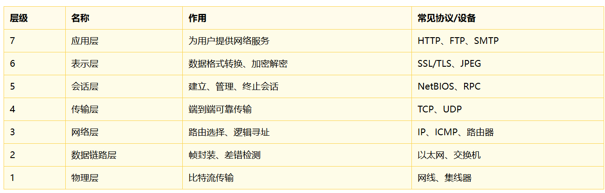

#  1.C++与网络编程概述

## 1.1这门课讲什么

1. **基础层：网络编程的基本API.**
2. **进阶层：高效能服务器。多线程、事件驱动、Reactor/Proactor模式、内存池、零拷贝。**
3. **实战层：从零搭建一个HTTP服务器、一个RPC框架、一个游戏后端。**

## 1.2 网络编程基础概念

1. **ip: ip定位的是主机**
2. **port：定位的是主机上的进程**
3. **协议：主机上的进程如何解析这些数据**
4. **客户端：一般是自动发起链接的**
5. **服务端：一般是被动的被链接的**

## 1.3 OSI与TCP/IP模型



1. **应用层：对应OSI的应用层、表示层、会话层。HTTP、FTP、DNS都在这一层。**
2. **传输层：对应OSI的传输层。TCP/UDP**
3. **网络层：对应OSI的网络层。IP协议是核心**
4. **数据链路层：MAC帧。**
5. **物理层：真正的数据流动。**

# 3Socket编程基础（上）

### 第一版服务端

```c++
#include <sys/socket.h>
#include <pthread.h>
#include <sys/types.h>
#include <netinet/in.h>
#include <iostream>
#include <unistd.h>
#include <cstring>
using namespace std;

struct inFo 
{
  pthread_t id;
  int fd;
};

void* hander(void* arg)
{
   struct inFo* info = static_cast<struct inFo*>(arg);
   char buffer[1024];
   cout<< "线程id:" << info->id <<endl;
   while(true)
   {
     // 注意这里读取是有问题的，TCP面向字节流，如何知道读取完成了呢？
     // 需要定制协议的。
     int n = read(info->fd, buffer, sizeof(buffer) - 1);
     if(n > 0)
     {
       buffer[n] = '\0';
       cout<< buffer <<endl;
       
       // 回显给客户端
       write(info->fd, buffer, n);
     }
     else if(n == 0)
     {
       cout<< "对方关闭了"<<endl;
       break;
     }
     else 
     {
       cout<< "出现错误了"<<endl;
       break;
     }
   }

  close(info->fd);
  delete info;
  return nullptr;
}

// 1.socket创建一个网络文件描述符
// 2.bind将网络文件描述符和ip+port关联起来的
// 3.listen访问监听描述符的放到队列里面
// 4.accept从队列里面进行拿去
// 5.read/write因为是全双工，可以进行互相通信的
// 6.close关闭网络文件描述符的。


// TCP 服务端基本流程：
//
// 1. socket：创建监听套接字，得到一个网络文件描述符 listenfd。
// 2. bind：将 listenfd 与本机 IP + 端口号绑定，使客户端能够通过该地址访问服务器。
// 3. listen：让 listenfd 进入监听状态，内核开始维护连接队列，等待客户端连接到来。
// 4. accept：从已完成连接队列中取出一个客户端连接，返回新的通信文件描述符 sockfd。
// 5. read/write：使用 accept 返回的 sockfd 与客户端进行数据收发；TCP 是全双工通信，双方都可以读写。
// 6. close：关闭不再使用的文件描述符，释放 socket 资源。

// TCP 服务端流程：
// socket  -> 创建监听 fd
// bind    -> 绑定 IP + port
// listen  -> 进入监听状态，等待客户端连接
// accept  -> 获取新连接，返回通信 fd
// read/write -> 基于通信 fd 与客户端收发数据
// close   -> 关闭 fd，释放资源

int main()
{
// 1.创建一个用于通信的网络文件描述符
    // int socket(int domain, int type, int protocol);
    // domain:通信的协议。AF_INET(IPV4), AF_INET6(IPV6),AF_UNIX(本机的进程间通信)。
    // type:通信的类型。流式活着数据报。
    // protocol: 具体使用哪个协议。一般是0
    // 注意：这个是TCP的监听链接的。
    int listenfd = socket(AF_INET, SOCK_STREAM, 0);
    if(listenfd == -1)
    {
      perror("socket");
      return -1;
    }
    cout<< "网络文件描述符创建成功" <<endl;

    // 设置端口复用
    // setsockopt功能函数的
    int opt = 1;
    setsockopt(listenfd, SOL_SOCKET, SO_REUSEADDR, &opt, sizeof(opt));

// 2.bind把文件描述符和ip+port进行绑定。
// 注意这里的端口的主机直接序和网络字节序
// 服务器的地址:INADDR_ANY;
   struct sockaddr_in local;
   memset(&local, 0, sizeof local);
   local.sin_family = AF_INET;
   local.sin_port = htons(8080);              // 1注意写服务器一般都是知名端口的。
   local.sin_addr.s_addr = htonl(INADDR_ANY); // 2注意写服务器一般都是任意服务器的地址进行访问的。
   
   int n = bind(listenfd, (struct sockaddr*)&local, sizeof local);
   if(n == -1)
   {
     perror("bind");
     close(listenfd);
     return -1;
   }
   cout<< "bind成功" <<endl;

// 3.开始监听了
// 开始让listenfd监听客户端的链接了。
// 默认可以接受多少个可以，超过了就丢弃了
   n = listen(listenfd, 128);
   if(n == -1)
   {
     perror("listen");
     close(listenfd);
     return -1;
   }
   cout<< "监听成功" <<endl;

// 4.监听成功了，就可以在监听队列里面拿数据了的。
   while(true)
   {
     // 监听我们需要知道信息的，
     // accept成功了，可以知道对方的信息的。 
     struct sockaddr_in client;
     socklen_t len  = sizeof(client);

     int socketfd =  accept(listenfd, (struct sockaddr*)&client, &len);
      if(socketfd < 0)
      {
        perror("accept");
        continue;
      }
      cout<< "新的链接到来了 socketfd" << socketfd <<endl;

  // 5.开始通信了
     struct inFo* info = new  struct inFo;
     info->fd = socketfd;

     pthread_create(&info->id, nullptr, hander, info);
     pthread_detach(info->id);
   }
  return 0;
}

```

### 第一版客户端

```c++
#include <sys/socket.h>
#include <arpa/inet.h>
#include <pthread.h>
#include <sys/types.h>
#include <netinet/in.h>
#include <iostream>
#include <unistd.h>
#include <cstring>
using namespace std;


// TCP 客户端基本流程：
//
// 1. socket：创建通信套接字，得到一个网络文件描述符 sockfd。
// 2. 不需要手动 bind：客户端通常由操作系统自动分配本机 IP 和临时端口。
// 3. connect：根据服务器的 IP + 端口，主动向服务器发起连接请求。
// 4. read/write：连接建立成功后，使用 sockfd 与服务器进行数据收发；TCP 是全双工通信。
// 5. close：通信结束后关闭 sockfd，释放 socket 资源。

// TCP 客户端流程：
// socket  -> 创建通信 fd
// connect -> 主动连接服务器 IP + port
// write   -> 向服务器发送数据
// read    -> 接收服务器返回的数据
// close   -> 关闭 fd，释放资源

// 服务端：socket -> bind -> listen -> accept -> read/write -> close
// 客户端：socket -> connect -> read/write -> close

int main(int argc, char* argv[])
{
  if(argc != 3)
  {
    cout<< "usage: ./a.out ip  port" <<endl;
    return -1;
  }

  string ip =  argv[1];
  uint16_t port = atoi(argv[2]);

// 1.创建一个网络通信的文件描述符
  int socketfd = socket(AF_INET, SOCK_STREAM, 0);
  if(socketfd == -1)
  {
    perror("socket");
    close(socketfd);
    return -1;
  }

// 2.客户端不需要bind。OS自动帮你bind。
// 3.客户端发起链接信息
// 需要知道服务器的ip+port
  struct sockaddr_in server;
  memset(&server, 0, sizeof server);
  server.sin_family  = AF_INET;
  server.sin_port = htons(port);
  inet_pton(AF_INET, ip.c_str(), &server.sin_addr); 
  
  int n = connect(socketfd, (struct sockaddr*)&server, sizeof server);
  if(n < 0)
  {
    perror("connect");
    close(socketfd);
    return -1;
  }
  
// 4.通信
  string message;
  while(true)
  {
    cout<< "enter:";
    getline(cin, message);

    if(strcmp("q", message.c_str()) == 0)
    {
      cout<< "客户端退出" <<endl;
      break;
    }

    ssize_t ret =  write(socketfd, message.c_str(), message.size());
    if(ret < 0)
    {
      perror("write");
      break;
    }
  }
  close(socketfd);
  return 0;
}

```


### 第二版服务端

```c++
#include <sys/socket.h>
#include <pthread.h>
#include <sys/types.h>
#include <arpa/inet.h>
#include <netinet/in.h>
#include <iostream>
#include <unistd.h>
#include <cstring>
#include <cerrno>

using namespace std;

#define PORT 8080
#define BACKLOG 128
#define BUFFER_SIZE 1024

// 每个客户端连接对应一个通信 fd
// 主线程 accept 得到 connfd，然后传给子线程处理
struct ThreadInfo
{
    int connfd;
};

// 尽量把数据完整写回客户端
// 因为 write 不保证一次把所有数据都写完
bool WriteAll(int fd, const char* data, size_t len)
{
    size_t total = 0;

    while (total < len)
    {
        ssize_t n = write(fd, data + total, len - total);

        if (n > 0)
        {
            total += n;
        }
        else if (n == 0)
        {
            return false;
        }
        else
        {
            perror("write");
            return false;
        }
    }

    return true;
}

// 子线程处理函数
// 一个线程负责一个客户端连接
void* Handler(void* arg)
{
    ThreadInfo* info = static_cast<ThreadInfo*>(arg);
    int connfd = info->connfd;

    // 参数已经取出来了，后面不再需要动态申请的 info
    delete info;

    cout << "子线程启动，线程 ID: " << pthread_self() << endl;

    char buffer[BUFFER_SIZE];

    while (true)
    {
        // TCP 是面向字节流的：
        // read 一次不代表收到一条完整消息。
        // 这里是入门版 echo server，读到多少就处理多少。
        ssize_t n = read(connfd, buffer, sizeof(buffer) - 1);

        if (n > 0)
        {
            buffer[n] = '\0';

            cout << "client say: " << buffer << endl;

            // 回显给客户端
            if (!WriteAll(connfd, buffer, n))
            {
                break;
            }
        }
        else if (n == 0)
        {
            // read 返回 0，表示对端关闭连接
            cout << "客户端关闭连接" << endl;
            break;
        }
        else
        {
            // read 返回 -1，表示读取出错
            perror("read");
            break;
        }
    }

    close(connfd);
    cout << "连接已关闭，线程退出" << endl;

    return nullptr;
}

int main()
{
    // ============================================================
    // TCP 服务端基本流程：
    //
    // 1. socket：创建监听套接字 listenfd。
    // 2. bind：将 listenfd 绑定到本机 IP + 端口。
    // 3. listen：让 listenfd 进入监听状态，内核维护连接队列。
    // 4. accept：从已完成连接队列中取出一个连接，返回通信 fd。
    // 5. read/write：使用通信 fd 与客户端进行数据收发。
    // 6. close：关闭不再使用的 fd，释放 socket 资源。
    // ============================================================

    // 1. 创建监听 socket
    // AF_INET：IPv4
    // SOCK_STREAM：TCP 字节流
    // 0：让系统自动选择 TCP 协议
    int listenfd = socket(AF_INET, SOCK_STREAM, 0);
    if (listenfd < 0)
    {
        perror("socket");
        return -1;
    }

    cout << "socket 创建成功，listenfd: " << listenfd << endl;

    // 2. 设置端口复用
    // 避免服务器刚退出又马上启动时出现 Address already in use
    int opt = 1;
    if (setsockopt(listenfd, SOL_SOCKET, SO_REUSEADDR, &opt, sizeof(opt)) < 0)
    {
        perror("setsockopt");
        close(listenfd);
        return -1;
    }

    // 3. 填写服务端地址信息
    struct sockaddr_in local;
    memset(&local, 0, sizeof(local));

    local.sin_family = AF_INET;

    // 端口号需要从主机字节序转成网络字节序
    local.sin_port = htons(PORT);

    // INADDR_ANY 表示绑定本机所有网卡 IP
    // 例如 127.0.0.1、局域网 IP、公网 IP 都可以访问
    local.sin_addr.s_addr = htonl(INADDR_ANY);

    // 4. 绑定 IP + 端口
    if (bind(listenfd, reinterpret_cast<struct sockaddr*>(&local), sizeof(local)) < 0)
    {
        perror("bind");
        close(listenfd);
        return -1;
    }

    cout << "bind 成功，端口: " << PORT << endl;

    // 5. 进入监听状态
    // BACKLOG 表示已完成连接队列的长度上限
    if (listen(listenfd, BACKLOG) < 0)
    {
        perror("listen");
        close(listenfd);
        return -1;
    }

    cout << "服务器启动成功，正在监听端口 " << PORT << "..." << endl;

    // 6. 主线程循环 accept 新连接
    while (true)
    {
        struct sockaddr_in client;
        socklen_t len = sizeof(client);

        // accept 成功后返回新的通信 fd
        // listenfd 继续负责监听，connfd 负责和客户端通信
        int connfd = accept(listenfd, reinterpret_cast<struct sockaddr*>(&client), &len);
        if (connfd < 0)
        {
            perror("accept");
            continue;
        }

        // 打印客户端 IP 和端口
        char ip[INET_ADDRSTRLEN] = {0};

        if (inet_ntop(AF_INET, &client.sin_addr, ip, sizeof(ip)) == nullptr)
        {
            perror("inet_ntop");
            strcpy(ip, "unknown");
        }

        cout << "新连接到来" << endl;
        cout << "client ip: " << ip << endl;
        cout << "client port: " << ntohs(client.sin_port) << endl;
        cout << "connfd: " << connfd << endl;

        // 7. 为当前客户端创建一个子线程
        ThreadInfo* info = new ThreadInfo;
        info->connfd = connfd;

        pthread_t tid;
        int ret = pthread_create(&tid, nullptr, Handler, info);
        if (ret != 0)
        {
            cerr << "pthread_create failed, ret: " << ret << endl;
            close(connfd);
            delete info;
            continue;
        }

        // 分离线程：线程结束后自动释放线程资源
        pthread_detach(tid);
    }

    close(listenfd);
    return 0;
}
```

### 第二版客户端

```c++
#include <sys/socket.h>
#include <arpa/inet.h>
#include <sys/types.h>
#include <netinet/in.h>
#include <iostream>
#include <unistd.h>
#include <cstring>
#include <cstdlib>

using namespace std;

#define BUFFER_SIZE 1024

// 尽量把数据完整发送出去
// 因为 write 不保证一次把所有数据都写完
bool WriteAll(int sockfd, const char* data, size_t len)
{
    size_t total = 0;

    while (total < len)
    {
        ssize_t n = write(sockfd, data + total, len - total);

        if (n > 0)
        {
            total += n;
        }
        else if (n == 0)
        {
            return false;
        }
        else
        {
            perror("write");
            return false;
        }
    }

    return true;
}

int main(int argc, char* argv[])
{
    // ============================================================
    // TCP 客户端基本流程：
    //
    // 1. socket：创建通信套接字，得到 sockfd。
    // 2. connect：根据服务器 IP + port 主动连接服务器。
    // 3. write：向服务器发送数据。
    // 4. read：接收服务器返回的数据。
    // 5. close：关闭 sockfd，释放 socket 资源。
    //
    // 客户端一般不需要手动 bind：
    // 因为客户端不需要固定端口等待别人连接，
    // 操作系统会自动分配本机 IP 和临时端口。
    // ============================================================

    if (argc != 3)
    {
        cout << "usage: " << argv[0] << " ip port" << endl;
        return -1;
    }

    string ip = argv[1];
    uint16_t port = static_cast<uint16_t>(atoi(argv[2]));

    // 1. 创建 TCP socket
    // AF_INET：IPv4
    // SOCK_STREAM：TCP 字节流
    // 0：让系统自动选择 TCP 协议
    int sockfd = socket(AF_INET, SOCK_STREAM, 0);
    if (sockfd < 0)
    {
        perror("socket");
        return -1;
    }

    // 2. 填写服务器地址信息
    struct sockaddr_in server;
    memset(&server, 0, sizeof(server));

    server.sin_family = AF_INET;

    // 端口号需要从主机字节序转成网络字节序
    server.sin_port = htons(port);

    // inet_pton：
    // p = presentation，人能看懂的字符串 IP，例如 "127.0.0.1"
    // n = network，网络使用的二进制 IP
    //
    // inet_pton 表示：
    // 字符串 IP -> 网络二进制 IP
    if (inet_pton(AF_INET, ip.c_str(), &server.sin_addr) <= 0)
    {
        perror("inet_pton");
        close(sockfd);
        return -1;
    }

    // 3. 主动连接服务器
    // connect 成功返回 0，失败返回 -1
    if (connect(sockfd, reinterpret_cast<struct sockaddr*>(&server), sizeof(server)) < 0)
    {
        perror("connect");
        close(sockfd);
        return -1;
    }

    cout << "connect success" << endl;

    // 4. 开始通信
    char buffer[BUFFER_SIZE];
    string message;

    while (true)
    {
        cout << "enter: ";
        getline(cin, message);

        if (message == "q")
        {
            cout << "客户端退出" << endl;
            break;
        }

        // 向服务器发送数据
        if (!WriteAll(sockfd, message.c_str(), message.size()))
        {
            break;
        }

        // 从服务器读取回显数据
        // 注意：这里假设服务器会回显数据。
        // 如果服务器只 read 不 write，这里的 read 会阻塞等待。
        ssize_t n = read(sockfd, buffer, sizeof(buffer) - 1);

        if (n > 0)
        {
            buffer[n] = '\0';
            cout << "server echo: " << buffer << endl;
        }
        else if (n == 0)
        {
            cout << "服务器关闭连接" << endl;
            break;
        }
        else
        {
            perror("read");
            break;
        }
    }

    close(sockfd);
    return 0;
}
```


# 4Socket编程基础（下）


# 6select

```c++
#include <iostream>
#include <cstring>
#include <unistd.h>
#include <sys/socket.h>
#include <sys/select.h>
#include <netinet/in.h>
#include <arpa/inet.h>

using namespace std;

#define PORT 8080
#define BACKLOG 128
#define BUFFER_SIZE 1024

int main()
{
    // 1. 创建监听 socket
    int listenfd = socket(AF_INET, SOCK_STREAM, 0);
    if (listenfd < 0)
    {
        perror("socket");
        return -1;
    }

    // 2. 设置端口复用
    int opt = 1;
    setsockopt(listenfd, SOL_SOCKET, SO_REUSEADDR, &opt, sizeof(opt));

    // 3. 绑定 IP + 端口
    struct sockaddr_in local;
    memset(&local, 0, sizeof(local));

    local.sin_family = AF_INET;
    local.sin_port = htons(PORT);
    local.sin_addr.s_addr = htonl(INADDR_ANY);

    if (bind(listenfd, (struct sockaddr*)&local, sizeof(local)) < 0)
    {
        perror("bind");
        close(listenfd);
        return -1;
    }

    // 4. 监听
    if (listen(listenfd, BACKLOG) < 0)
    {
        perror("listen");
        close(listenfd);
        return -1;
    }

    cout << "select server start, port: " << PORT << endl;

    // 5. 定义一个数组，用来保存所有需要被 select 监听的 fd
    // clientfds[0] 放 listenfd
    // 后面的位置放 accept 返回的通信 fd
    int clientfds[FD_SETSIZE];

    for (int i = 0; i < FD_SETSIZE; ++i)
    {
        clientfds[i] = -1;
    }

    clientfds[0] = listenfd;

    int maxfd = listenfd;

    while (true)
    {
        // 6. 每次调用 select 前，都要重新设置 fd_set
        // 因为 select 会修改这个集合
        fd_set readfds;
        FD_ZERO(&readfds);
		
        // 设置进readfds里面去的。
        for (int i = 0; i < FD_SETSIZE; ++i)
        {
            if (clientfds[i] != -1)
            {
                FD_SET(clientfds[i], &readfds);

                if (clientfds[i] > maxfd)
                {
                    maxfd = clientfds[i];
                }
            }
        }

        // 7. 调用 select，等待某些 fd 变得可读
        // maxfd + 1：告诉内核检查 [0, maxfd] 这些 fd
        int n = select(maxfd + 1, &readfds, nullptr, nullptr, nullptr);

        if (n < 0)
        {
            perror("select");
            break;
        }

        // 8. 判断 listenfd 是否就绪
        // 如果 listenfd 可读，说明有新连接到来。放到额外维护的数组里面去。
        if (FD_ISSET(listenfd, &readfds))
        {
            struct sockaddr_in client;
            socklen_t len = sizeof(client);

            int connfd = accept(listenfd, (struct sockaddr*)&client, &len);
            if (connfd < 0)
            {
                perror("accept");
                continue;
            }

            char ip[INET_ADDRSTRLEN];
            inet_ntop(AF_INET, &client.sin_addr, ip, sizeof(ip));

            cout << "new client connected" << endl;
            cout << "client ip: " << ip << endl;
            cout << "client port: " << ntohs(client.sin_port) << endl;
            cout << "connfd: " << connfd << endl;

            // 把新的通信 fd 加入 clientfds 数组
            int pos = -1;
            for (int i = 1; i < FD_SETSIZE; ++i)
            {
                if (clientfds[i] == -1)
                {
                    pos = i;
                    break;
                }
            }

            if (pos == -1)
            {
                cout << "too many clients" << endl;
                close(connfd);
            }
            else
            {
                clientfds[pos] = connfd;

                if (connfd > maxfd)
                {
                    maxfd = connfd;
                }
            }
        }

        // 9. 判断普通通信 fd 是否就绪
        // 如果通信 fd 可读，说明客户端发来了数据
        for (int i = 1; i < FD_SETSIZE; ++i)
        {
            int fd = clientfds[i];

            if (fd == -1)
            {
                continue;
            }

            if (FD_ISSET(fd, &readfds))
            {
                char buffer[BUFFER_SIZE];

                ssize_t ret = read(fd, buffer, sizeof(buffer) - 1);

                if (ret > 0)
                {
                    buffer[ret] = '\0';

                    cout << "client fd " << fd << " say: " << buffer << endl;

                    // 回显给客户端
                    write(fd, buffer, ret);
                }
                else if (ret == 0)
                {
                    cout << "client fd " << fd << " closed" << endl;

                    close(fd);
                    clientfds[i] = -1;
                }
                else
                {
                    perror("read");

                    close(fd);
                    clientfds[i] = -1;
                }
            }
        }
    }

    close(listenfd);
    return 0;
}
```

**1.创建一个额外的数组   clientfds，数组第一个元素放的listenfd。**

**2.进入select的时候，先把clientfds放到 readfds里面去的。并更新maxfd。**

**3.然后检查是不是监听套接字返回了。返回了放到  clientfds里面去的。更新 maxfd.**

**4.检查是不是一般的套接字返回的。通信，通信结束然后对应位置-1.**

```
用户层维护一批 fd
        |
        v
FD_SET 加入 fd_set
        |
        v
select 交给内核检测
        |
        v
select 返回就绪 fd
        |
        v
用户层遍历所有 fd
        |
        v
FD_ISSET 判断哪个 fd 就绪
        |
        v
处理对应事件
```


# 7poll

```c++
#include <iostream>
#include <cstring>
#include <unistd.h>
#include <poll.h>
#include <sys/socket.h>
#include <netinet/in.h>
#include <arpa/inet.h>

using namespace std;

#define PORT 8080
#define BACKLOG 128
#define BUFFER_SIZE 1024
#define MAX_CLIENTS 1024

int main()
{
    // 1. 创建监听 socket
    int listenfd = socket(AF_INET, SOCK_STREAM, 0);
    if (listenfd < 0)
    {
        perror("socket");
        return -1;
    }

    // 2. 设置端口复用
    int opt = 1;
    if (setsockopt(listenfd, SOL_SOCKET, SO_REUSEADDR, &opt, sizeof(opt)) < 0)
    {
        perror("setsockopt");
        close(listenfd);
        return -1;
    }

    // 3. 绑定 IP + 端口
    struct sockaddr_in local;
    memset(&local, 0, sizeof(local));

    local.sin_family = AF_INET;
    local.sin_port = htons(PORT);
    local.sin_addr.s_addr = htonl(INADDR_ANY);

    if (bind(listenfd, (struct sockaddr*)&local, sizeof(local)) < 0)
    {
        perror("bind");
        close(listenfd);
        return -1;
    }

    // 4. 开始监听
    if (listen(listenfd, BACKLOG) < 0)
    {
        perror("listen");
        close(listenfd);
        return -1;
    }

    cout << "poll server start, port: " << PORT << endl;

    // 5. 创建 pollfd 数组
    // pollfd 结构体中包含：
    // fd      ：要监听的文件描述符
    // events  ：用户关心的事件
    // revents ：内核实际返回的就绪事件
    struct pollfd fds[MAX_CLIENTS];

    // 初始化所有位置为 -1，表示这个位置没有被使用
    for (int i = 0; i < MAX_CLIENTS; ++i)
    {
        fds[i].fd = -1;
        fds[i].events = 0;
        fds[i].revents = 0;
    }

    // 6. 把 listenfd 放到 pollfd 数组的第 0 个位置
    // POLLIN 表示关心可读事件
    // 对 listenfd 来说，可读表示有新连接到来
    fds[0].fd = listenfd;
    fds[0].events = POLLIN;

    int nfds = 1; // 当前 pollfd 数组中有效元素的数量

    while (true)
    {
        // 7. 调用 poll，等待 fd 就绪
        // 参数1：pollfd 数组
        // 参数2：数组中需要检查的元素个数
        // 参数3：超时时间，-1 表示永久阻塞等待
        int ready = poll(fds, nfds, -1);

        if (ready < 0)
        {
            perror("poll");
            break;
        }

        // 8. 判断 listenfd 是否就绪
        // 如果 listenfd 可读，说明有新客户端连接到来
        if (fds[0].revents & POLLIN)
        {
            struct sockaddr_in client;
            socklen_t len = sizeof(client);

            int connfd = accept(listenfd, (struct sockaddr*)&client, &len);
            if (connfd < 0)
            {
                perror("accept");
                continue;
            }

            char ip[INET_ADDRSTRLEN] = {0};
            inet_ntop(AF_INET, &client.sin_addr, ip, sizeof(ip));

            cout << "new client connected" << endl;
            cout << "client ip: " << ip << endl;
            cout << "client port: " << ntohs(client.sin_port) << endl;
            cout << "connfd: " << connfd << endl;

            // 9. 把新的 connfd 加入 pollfd 数组
            int pos = -1;

            for (int i = 1; i < MAX_CLIENTS; ++i)
            {
                if (fds[i].fd == -1)
                {
                    pos = i;
                    break;
                }
            }

            if (pos == -1)
            {
                cout << "too many clients" << endl;
                close(connfd);
            }
            else
            {
                fds[pos].fd = connfd;
                fds[pos].events = POLLIN;
                fds[pos].revents = 0;

                if (pos >= nfds)
                {
                    nfds = pos + 1;
                }
            }
        }

        // 10. 遍历普通通信 fd
        // 如果某个 connfd 可读，说明客户端发数据来了
        for (int i = 1; i < nfds; ++i)
        {
            int fd = fds[i].fd;

            if (fd == -1)
            {
                continue;
            }

            if (fds[i].revents & POLLIN)
            {
                char buffer[BUFFER_SIZE];

                ssize_t n = read(fd, buffer, sizeof(buffer) - 1);

                if (n > 0)
                {
                    buffer[n] = '\0';

                    cout << "client fd " << fd << " say: " << buffer << endl;

                    // 回显给客户端
                    write(fd, buffer, n);
                }
                else if (n == 0)
                {
                    cout << "client fd " << fd << " closed" << endl;

                    close(fd);
                    fds[i].fd = -1;
                    fds[i].events = 0;
                    fds[i].revents = 0;
                }
                else
                {
                    perror("read");

                    close(fd);
                    fds[i].fd = -1;
                    fds[i].events = 0;
                    fds[i].revents = 0;
                }
            }
        }
    }

    close(listenfd);
    return 0;
}
```


# epoll

```c++
#include <iostream>
#include <cstring>
#include <unistd.h>
#include <sys/socket.h>
#include <sys/epoll.h>
#include <netinet/in.h>
#include <arpa/inet.h>

using namespace std;

#define PORT 8080
#define BACKLOG 128
#define BUFFER_SIZE 1024
#define MAX_EVENTS 1024

int main()
{
    // ============================================================
    // TCP + epoll 服务端基本流程：
    //
    // 1. socket：创建监听套接字 listenfd
    // 2. bind：绑定 IP + port
    // 3. listen：让 listenfd 进入监听状态
    // 4. epoll_create：创建 epoll 模型，得到 epfd
    // 5. epoll_ctl：把 listenfd 添加到 epoll 中
    // 6. epoll_wait：等待 fd 就绪
    // 7. listenfd 就绪：说明有新连接，accept
    // 8. connfd 就绪：说明客户端发来数据，read/write
    // 9. close：关闭 fd，并从 epoll 中移除
    // ============================================================

    // 1. 创建监听 socket
    int listenfd = socket(AF_INET, SOCK_STREAM, 0);
    if (listenfd < 0)
    {
        perror("socket");
        return -1;
    }

    // 2. 设置端口复用
    int opt = 1;
    if (setsockopt(listenfd, SOL_SOCKET, SO_REUSEADDR, &opt, sizeof(opt)) < 0)
    {
        perror("setsockopt");
        close(listenfd);
        return -1;
    }

    // 3. 绑定 IP + 端口
    struct sockaddr_in local;
    memset(&local, 0, sizeof(local));

    local.sin_family = AF_INET;
    local.sin_port = htons(PORT);
    local.sin_addr.s_addr = htonl(INADDR_ANY);

    if (bind(listenfd, (struct sockaddr*)&local, sizeof(local)) < 0)
    {
        perror("bind");
        close(listenfd);
        return -1;
    }

    // 4. 监听
    if (listen(listenfd, BACKLOG) < 0)
    {
        perror("listen");
        close(listenfd);
        return -1;
    }

    cout << "epoll server start, port: " << PORT << endl;

    // 5. 创建 epoll 模型
    // epfd 是 epoll 的文件描述符，后续通过它管理所有被监听的 fd
    int epfd = epoll_create(1);
    if (epfd < 0)
    {
        perror("epoll_create");
        close(listenfd);
        return -1;
    }

    // 6. 把 listenfd 添加到 epoll 中
    // EPOLLIN 表示关心可读事件
    // 对 listenfd 来说，可读表示有新连接到来
    struct epoll_event ev;
    ev.events = EPOLLIN;
    ev.data.fd = listenfd;

    if (epoll_ctl(epfd, EPOLL_CTL_ADD, listenfd, &ev) < 0)
    {
        perror("epoll_ctl add listenfd");
        close(listenfd);
        close(epfd);
        return -1;
    }

    // 用来保存 epoll_wait 返回的就绪事件
    struct epoll_event events[MAX_EVENTS];

    while (true)
    {
        // 7. 等待事件发生
        // 参数1：epoll fd
        // 参数2：保存就绪事件的数组
        // 参数3：最多返回多少个就绪事件
        // 参数4：超时时间，-1 表示一直阻塞等待
        int n = epoll_wait(epfd, events, MAX_EVENTS, -1);

        if (n < 0)
        {
            perror("epoll_wait");
            break;
        }

        // 8. 遍历所有就绪事件
        for (int i = 0; i < n; ++i)
        {
            int fd = events[i].data.fd;

            // 9. 如果 listenfd 就绪，说明有新客户端连接
            if (fd == listenfd)
            {
                struct sockaddr_in client;
                socklen_t len = sizeof(client);

                int connfd = accept(listenfd, (struct sockaddr*)&client, &len);
                if (connfd < 0)
                {
                    perror("accept");
                    continue;
                }

                char ip[INET_ADDRSTRLEN] = {0};
                inet_ntop(AF_INET, &client.sin_addr, ip, sizeof(ip));

                cout << "new client connected" << endl;
                cout << "client ip: " << ip << endl;
                cout << "client port: " << ntohs(client.sin_port) << endl;
                cout << "connfd: " << connfd << endl;

                // 10. 把新的通信 fd 添加到 epoll 中
                // 对 connfd 来说，EPOLLIN 表示客户端发来数据
                struct epoll_event conn_ev;
                conn_ev.events = EPOLLIN;
                conn_ev.data.fd = connfd;

                if (epoll_ctl(epfd, EPOLL_CTL_ADD, connfd, &conn_ev) < 0)
                {
                    perror("epoll_ctl add connfd");
                    close(connfd);
                    continue;
                }
            }
            else
            {
                // 11. 普通通信 fd 就绪，说明客户端发来了数据
                char buffer[BUFFER_SIZE];

                ssize_t ret = read(fd, buffer, sizeof(buffer) - 1);

                if (ret > 0)
                {
                    buffer[ret] = '\0';

                    cout << "client fd " << fd << " say: " << buffer << endl;

                    // 回显给客户端
                    write(fd, buffer, ret);
                }
                else if (ret == 0)
                {
                    // read 返回 0，表示客户端关闭连接
                    cout << "client fd " << fd << " closed" << endl;

                    // 先从 epoll 中删除，再关闭 fd
                    epoll_ctl(epfd, EPOLL_CTL_DEL, fd, nullptr);
                    close(fd);
                }
                else
                {
                    perror("read");

                    epoll_ctl(epfd, EPOLL_CTL_DEL, fd, nullptr);
                    close(fd);
                }
            }
        }
    }

    close(listenfd);
    close(epfd);

    return 0;
}
```


